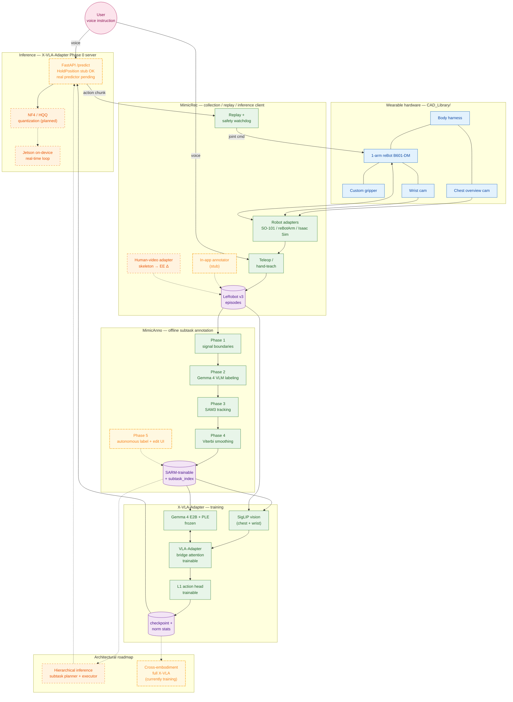
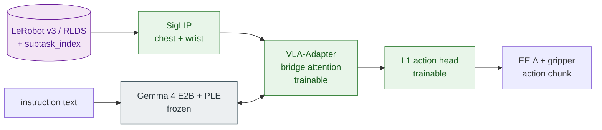
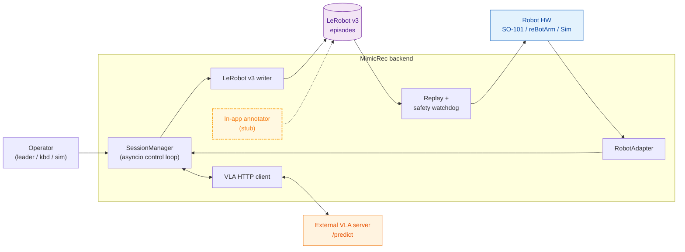
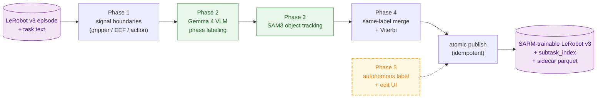

# vla-gemma-4

[English](README.md) | **日本語**

> Gemma 4 をバックボーンとした、ハンズフリー・視覚共有のウェアラブル相棒アーム — 腕や視覚に不自由のある方の日常を補助するプロトタイプ。

<!-- TODO: docs/images/hero.gif — 装着デモ ヒーロー -->

## TL;DR

- **このプロジェクト**: 音声で話しかけ、行動で応える、Gemma 4 ベースのウェアラブル VLA アシスタント。
- **なぜ Gemma 4 + VLA-Adapter か**: PLE × VLA-Adapter の bridge attention は他に類を見ないアーキ整合性をもち、 LLM 本体は凍結、 小さな adapter / projector / action head のみを学習する → 短期間での効率的な適応。 E2B クラスのオープンウェイト LLM だから on-device オフライン推論 (Jetson) も射程に入れた。
- **現在動く範囲**: シミュレーションで LIBERO-Spatial 94 % (X-VLA-Adapter v33)、 加えて実機 3 タスク (棚から取る / フタを開ける / 支える) の operator-supervised scripted demo。
- **5 分で評価するなら**:
  1. デモのメディアを見る → [Demo / What it does today](#demo--what-it-does-today)
  2. アーキを読む → [System overview](#system-overview)
  3. [Why Gemma 4 + VLA-Adapter](#why-gemma-4--vla-adapter) を流し読み
  4. LIBERO 94 % の根拠を確認 → [Reproducibility](#reproducibility)

## Mission

腕や視覚に不自由のある方は、 「もう一本の腕」 を必要としている — 棚からコップを取りたい、 フタを開けたい、 物を支えていてほしい、 そういう日常の所作を、 必要なタイミングで頼める腕を。

私たちが作っているのはまさにそれ。 体に装着できる 1 本のアーム、 胸の俯瞰カメラと wrist カメラ、 自然言語の音声指示を受け取り、 視覚をユーザーと共有しながら物理世界に作用する。 設計思想は **semi-autonomous な相棒** — 完全自律ではなく、 ユーザーの意図を拡張し、 補助する。

なぜ今か。 Gemma 4 のオープンウェイト・小型・on-device 性能と、 VLA-Adapter (Wang et al., 2025) の LLM 凍結 + 小さな adapter のみ学習する手法が組み合わさって、 **短期間・効率的な適応**が現実的射程に入った。 約 1.5 ヶ月のハッカソンスプリントでも LIBERO-Spatial 94 % まで到達できる。 *これは operator-supervised の研究プロトタイプであり、 医療機器ではありません。*

## Demo / What it does today

> **状態の注釈**: 以下の実機デモはすべて **operator-supervised の scripted demo** です。 物理 e-stop とソフトウェア watchdog の併用がセッション必須前提。 GIF / 動画はファイルが揃い次第差し替えます。

### 代表タスク (operator-supervised scripted demo)

- **棚から取る** — <!-- TODO: docs/images/demo_shelf.gif -->
- **フタを開ける** — <!-- TODO: docs/images/demo_lid.gif -->
- **支える / 持つ** — 持続的アシスト。 一般的な VLA pick-and-place との差別化点 — <!-- TODO: docs/images/demo_hold.gif -->

### Sim benchmark

- **LIBERO-Spatial 94 %** — X-VLA-Adapter v33、 47 / 50 episodes、 50 episode/suite、 4 タスク × 50 step
- 学習曲線: <!-- TODO: docs/images/v33_training_curve.png -->

### Reproducibility

| Artifact | Pointer |
|---|---|
| 学習 config | [`X-VLA-Adapter/configs/train/libero_spatial_v33.yaml`](./X-VLA-Adapter/configs/train/libero_spatial_v33.yaml) |
| Eval config | [`X-VLA-Adapter/configs/eval/libero_v33_step40000.yaml`](./X-VLA-Adapter/configs/eval/libero_v33_step40000.yaml) |
| Checkpoint | <!-- TODO: HF Hub または Drive 直リンク --> |
| Eval コマンド | `uv run python scripts/eval.py configs/eval/libero_v33_step40000.yaml` (`X-VLA-Adapter/` 配下で実行) |
| ハードウェア / SW | RTX 6000 Ada / Ubuntu 22.04 / CUDA 12.6 / Python 3.12 / `uv` lockfile committed |
| 正規化統計 | checkpoint と同梱 (`norm_stats.json`) |
| Model card | <!-- TODO: 限界・既知の挙動を含む model card へのリンク --> |

## System overview

> 凡例: 緑 solid = shipped / 黄 dot-dash = in-progress (stub / smoke / 学習中) / 橙 dashed = planned / 青 = hardware / 紫 = data store / ピンク = actor。
> Edge: 実線 = 動作する経路、 点線 = in-progress または planned へ向かう経路。

主要なデータ流: (1) ユーザーの音声 → MimicRec (推論 client) → X-VLA-Adapter Phase 0 server、 (2) 胸の俯瞰カメラ + wrist カメラ → SigLIP → VLA-Adapter bridge attention で Gemma 4 (frozen) と対話 → action head → 1 アーム、 (3) データ収集ループ: MimicRec で集めた LeRobot v3 episode → MimicAnno で subtask アノテ → X-VLA-Adapter で再学習。 on-device offline 動作 (Jetson クラス) を **目標** とし、 学習はクラウド/オンプレ GPU。

<!-- 任意: docs/images/system_architecture.png — より洗練された装着写真ベースの図、 用意でき次第差し替え -->

## Why Gemma 4 + VLA-Adapter

このプロジェクトで Gemma 4 が動いている場所:

| Where | What |
|---|---|
| `X-VLA-Adapter` | 推論時の VLA バックボーン (E2B)。 各層に bridge attention を介して視覚 / 動作トークンが注入される |
| `MimicAnno` Phase 2 | オフラインで segment ごとに subtask phase をラベリングする VLM (image-text-to-text) |
| 多言語指示 | 日英両言語の自然言語指示を直接食わせる |

このスタックを選んだ 5 つの理由:

1. **Designed for offline on-device** — E2B サイズで Jetson クラスを射程に入れる。 学習時は `bitsandbytes` 8-bit AdamW (`X-VLA-Adapter/src/vla_project/training/optim.py`) で memory 圧縮しているが、 推論側の NF4 / HQQ 量子化と Jetson real-time 推論ループはどちらも **Roadmap (未着手)**。
2. **PLE × VLA-Adapter bridge attention** — Gemma 4 の Per-Layer Embeddings は層ごとに存在し、 VLA-Adapter が各層に視覚 / 動作トークンを bridge attention で注入する設計と二段組で同居する。 本リポでは PAD placeholder ID を使って PLE 領域に custom token を流し込む engineering workaround も実装しており、 これが具体的な実装貢献。
3. **VLA-Adapter による短期間・効率的な適応** — VLA-Adapter (Wang et al., 2025) は LLM 本体を凍結し、 小さな adapter + projector + action head のみを学習する。 タイムラインへの影響:
   - 数百〜数千 episode で fine-tune が収束 (full fine-tune 比で桁違いに省コスト)
   - 新ロボット形態・新タスクへの転移が adapter 入替で効く
   - LoRA (r = 16 / 64) と組み合わせて約 1.5 ヶ月のハッカソン期間中に v3 → v37 まで sweep 可能だった
   - ハッカソン期間 (約 46 日、 残 10 日時点) で v33 が LIBERO 94 % に到達できたのはこの efficiency に直接依存している
4. **広範な世界知識 + 多言語** — オブジェクト名・物理直観・日英両言語の指示が generalize の足場になる。
5. **オープンウェイト** — LoRA / 量子化 / アーキ改造を自由に試せる。 v25 → v37 の architecture sweep (`X-VLA-Adapter/configs/train/`) はそれに依存している。

## The stack — 4 components

### `X-VLA-Adapter/` — VLA モデル / 学習 / 推論

**役割**: SigLIP + Gemma4-E2B + per-domain projector + L1 action head の VLA policy 本体。 LIBERO benchmark を主軸に、 実ロボット deploy までを 1 リポで吸収。

**できること**:
- 1 ファイルの train YAML で全アーキ revision を切替 (v3 → v37: LoRA / soft-prompt-in-LLM / wrist-into-LLM / DA-2-MLP / etc.)
- 1 ファイルの eval YAML で 50 ep × 4 suite × N step を自動 sweep
- Phase 0 FastAPI 推論サーバ (MimicRec の `/predict` 契約準拠。 HoldPosition stub 段階、 実モデル predictor は v36 ckpt 待ち)
- 4-domain RLDS + LeRobot 両 dataloader、 shared Q99 統計
- 階層 freeze、 LR coef per param group、 checkpoint resume
- (planned) NF4 / HQQ 量子化、 Jetson on-device real-time 推論ループ

**設計原則** (本 submodule の `CLAUDE.md` 参照): `data` / `models` / `policies` / `training` / `evaluation` / `deployment` / `robots` を厳格に分離、 すべて config 駆動、 夜間 sweep でも壊れにくい。

**結果ハイライト**: LIBERO-Spatial v33 = 94 % (47 / 50)。

**内部フロー**:

**詳細**: → [`X-VLA-Adapter/README.md`](./X-VLA-Adapter/README.md)

### `MimicRec/` — local-first データ収集 Web アプリ

**役割**: 物理ロボから IL データを集めて LeRobot v3 で吐く Web アプリ。 Teleop / Hand-teach / Replay / VLA inference を 1 スタックで一気通貫。

**できること**:
- Teleop (leader arm / keyboard / sim) で記録、 Hand-teach は重力補償 + グリッパ摩擦補償付き (reBotArm)
- Replay は arm + gripper 同期再生 + safety watchdog (joint position jump / velocity / acceleration の三段ゲート)
- VLA HTTP contract YAML 1 枚で任意の VLA モデルを実機にぶら下げ
- LeRobot v3 zip ダウンロード、 エピソード review (success / failure ラベル)
- Settings UI: デバイス検出、 キャリブ状態、 アダプタ config 編集
- ~250 backend tests、 500 Hz モータ制御は別 daemon で安全分離

**対応ハード**: SO-101 / reBot Arm B601-DM / Mock / Isaac Sim (Franka 検証済)。 新ロボットは `RobotAdapter` protocol を 1 ファイル足すだけで UI に出る。

**内部フロー**:

**詳細**: → [`MimicRec/README.md`](./MimicRec/README.md)

### `MimicAnno/` — オフライン subtask アノテーション

**役割**: LeRobot v3 episode に subtask boundary + ラベルを付け、 SARM 学習可能 dataset に export するオフラインツール。

**できること**:
- **Phase 1** — signal-driven boundary 検出 (gripper transition / EEF 速度 / action-norm change point)
- **Phase 2** — Gemma 4 VLM で segment ごとに phase ラベリング (allowed-label + JSON schema 強制、 不正出力で fail-fast)
- **Phase 3** — SAM3 で task-text-driven object tracking、 boundary score へ統合
- **Phase 4** — 同ラベル merge + min-duration absorb + Viterbi relabel
- **Export** — per-frame `subtask_index` + episode-level subtask list、 atomic publish、 idempotent re-run
- React / Vite read-only timeline + waveform viewer
- YAML で任意の LeRobot v3 layout に対応 (so100 / koch / aloha / SO-101 generic)
- (in-progress) Phase 5 — 自律ラベル + 編集 UI

**内部フロー**:

**詳細**: → [`MimicAnno/README.md`](./MimicAnno/README.md)

### `CAD_Library/` — ウェアラブルハードウェア

**役割**: ウェアラブル装着の物理一式 (オープン CAD)。 **submodule ではなく root リポジトリ内の通常ディレクトリ**で、 SLDPRT / SLDASM / STEP は git-lfs で管理。

**収録**:
- `Robot_Arm/reBot_B601_DM_v1.0_20260331.step` — アーム本体 (STEP)
- `Gripper/gripper.SLDASM` — カスタム軽量グリッパ
- `Harness/bodey harness.SLDASM` — 体に装着するハーネス
- `Data_Collection_Device/{ver1,ver2}/` — 胸カメラ + データ収集治具

**閲覧**: SolidWorks があれば直接、 そうでなければ STEP を CAD ビューワーや FreeCAD で開けば寸法は確認できる。

## Quickstart

## Safety & Scope

### 現状の安全措置

### Scope (何であって何でないか)

## Status & Roadmap

### Shipped

### In progress

### Roadmap — NOT IMPLEMENTED

## Acknowledgements

## License
