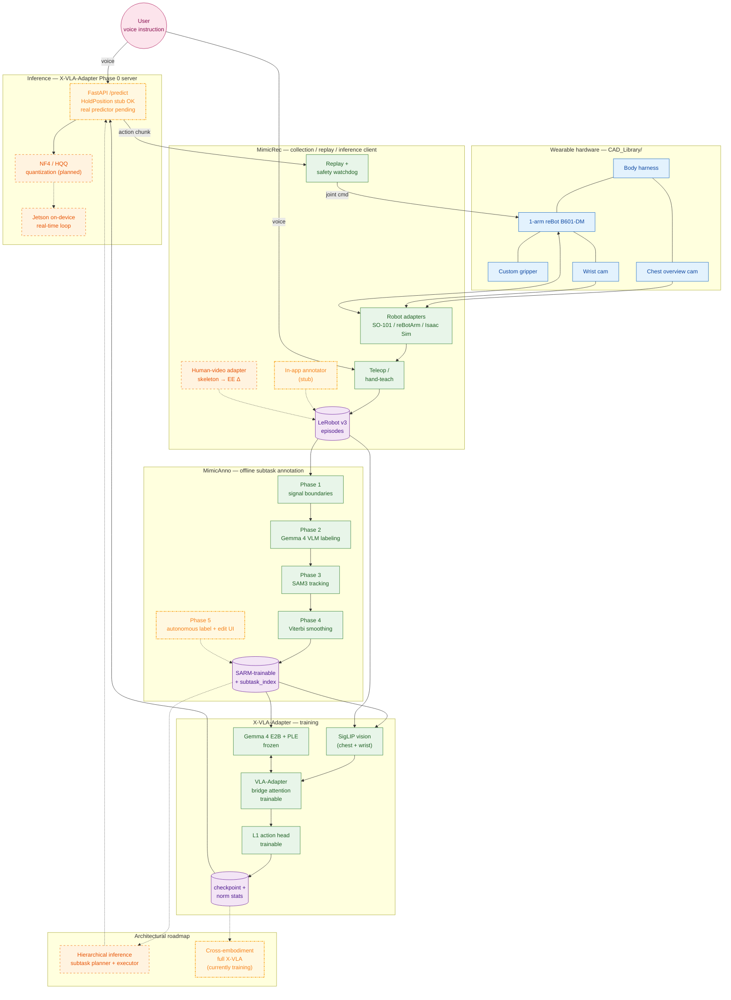

# vla-gemma-4

[English](README.md) | **日本語**

> Gemma 4 をバックボーンとした、ハンズフリー・視覚共有のウェアラブル相棒アーム — 腕や視覚に不自由のある方の日常を補助するプロトタイプ。

<!-- TODO: docs/images/hero.gif — 装着デモ ヒーロー -->

## TL;DR

- **このプロジェクト**: 音声で話しかけ、行動で応える、Gemma 4 ベースのウェアラブル VLA アシスタント。
- **なぜ Gemma 4 + VLA-Adapter か**: PLE × VLA-Adapter の bridge attention は他に類を見ないアーキ整合性をもち、 LLM 本体は凍結、 小さな adapter / projector / action head のみを学習する → 短期間での効率的な適応。 E2B クラスのオープンウェイト LLM だから on-device オフライン推論 (Jetson) も射程に入れた。
- **現在動く範囲**: シミュレーションで LIBERO-Spatial 94 % (X-VLA-Adapter v33)、 加えて実機 3 タスク (棚から取る / フタを開ける / 支える) の operator-supervised scripted demo。
- **5 分で評価するなら**:
  1. デモのメディアを見る → [Demo / What it does today](#demo--what-it-does-today)
  2. アーキを読む → [System overview](#system-overview)
  3. [Why Gemma 4 + VLA-Adapter](#why-gemma-4--vla-adapter) を流し読み
  4. LIBERO 94 % の根拠を確認 → [Reproducibility](#reproducibility)

## Mission

腕や視覚に不自由のある方は、 「もう一本の腕」 を必要としている — 棚からコップを取りたい、 フタを開けたい、 物を支えていてほしい、 そういう日常の所作を、 必要なタイミングで頼める腕を。

私たちが作っているのはまさにそれ。 体に装着できる 1 本のアーム、 胸の俯瞰カメラと wrist カメラ、 自然言語の音声指示を受け取り、 視覚をユーザーと共有しながら物理世界に作用する。 設計思想は **semi-autonomous な相棒** — 完全自律ではなく、 ユーザーの意図を拡張し、 補助する。

なぜ今か。 Gemma 4 のオープンウェイト・小型・on-device 性能と、 VLA-Adapter (Wang et al., 2025) の LLM 凍結 + 小さな adapter のみ学習する手法が組み合わさって、 **短期間・効率的な適応**が現実的射程に入った。 約 1.5 ヶ月のハッカソンスプリントでも LIBERO-Spatial 94 % まで到達できる。 *これは operator-supervised の研究プロトタイプであり、 医療機器ではありません。*

## Demo / What it does today

> **状態の注釈**: 以下の実機デモはすべて **operator-supervised の scripted demo** です。 物理 e-stop とソフトウェア watchdog の併用がセッション必須前提。 GIF / 動画はファイルが揃い次第差し替えます。

### 代表タスク (operator-supervised scripted demo)

- **棚から取る** — <!-- TODO: docs/images/demo_shelf.gif -->
- **フタを開ける** — <!-- TODO: docs/images/demo_lid.gif -->
- **支える / 持つ** — 持続的アシスト。 一般的な VLA pick-and-place との差別化点 — <!-- TODO: docs/images/demo_hold.gif -->

### Sim benchmark

- **LIBERO-Spatial 94 %** — X-VLA-Adapter v33、 47 / 50 episodes、 50 episode/suite、 4 タスク × 50 step
- 学習曲線: <!-- TODO: docs/images/v33_training_curve.png -->

### Reproducibility

| Artifact | Pointer |
|---|---|
| 学習 config | [`X-VLA-Adapter/configs/train/libero_spatial_v33.yaml`](./X-VLA-Adapter/configs/train/libero_spatial_v33.yaml) |
| Eval config | [`X-VLA-Adapter/configs/eval/libero_v33_step40000.yaml`](./X-VLA-Adapter/configs/eval/libero_v33_step40000.yaml) |
| Checkpoint | <!-- TODO: HF Hub または Drive 直リンク --> |
| Eval コマンド | `uv run python scripts/eval.py configs/eval/libero_v33_step40000.yaml` (`X-VLA-Adapter/` 配下で実行) |
| ハードウェア / SW | RTX 6000 Ada / Ubuntu 22.04 / CUDA 12.6 / Python 3.12 / `uv` lockfile committed |
| 正規化統計 | checkpoint と同梱 (`norm_stats.json`) |
| Model card | <!-- TODO: 限界・既知の挙動を含む model card へのリンク --> |

## System overview

> 凡例: 緑 solid = shipped / 黄 dot-dash = in-progress (stub / smoke / 学習中) / 橙 dashed = planned / 青 = hardware / 紫 = data store / ピンク = actor。
> Edge: 実線 = 動作する経路、 点線 = in-progress または planned へ向かう経路。

主要なデータ流: (1) ユーザーの音声 → MimicRec (推論 client) → X-VLA-Adapter Phase 0 server、 (2) 胸の俯瞰カメラ + wrist カメラ → SigLIP → VLA-Adapter bridge attention で Gemma 4 (frozen) と対話 → action head → 1 アーム、 (3) データ収集ループ: MimicRec で集めた LeRobot v3 episode → MimicAnno で subtask アノテ → X-VLA-Adapter で再学習。 on-device offline 動作 (Jetson クラス) を **目標** とし、 学習はクラウド/オンプレ GPU。

<!-- 任意: docs/images/system_architecture.png — より洗練された装着写真ベースの図、 用意でき次第差し替え -->

## Why Gemma 4 + VLA-Adapter

## The stack — 4 components

### `X-VLA-Adapter/` — VLA モデル / 学習 / 推論

### `MimicRec/` — local-first データ収集 Web アプリ

### `MimicAnno/` — オフライン subtask アノテーション

### `CAD_Library/` — ウェアラブルハードウェア

## Quickstart

## Safety & Scope

### 現状の安全措置

### Scope (何であって何でないか)

## Status & Roadmap

### Shipped

### In progress

### Roadmap — NOT IMPLEMENTED

## Acknowledgements

## License
