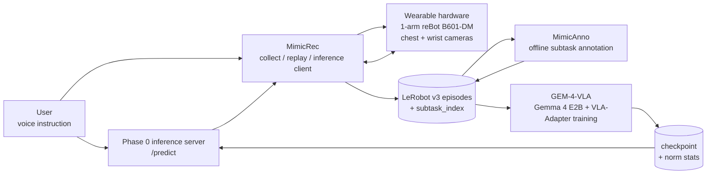

# vla-gemma-4

[English](README.md) | **日本語**

> Gemma 4 をバックボーンにしたウェアラブル Vision-Language-Action アシスタント。見て、音声指示を理解し、動いて支援する、ハンズフリーの相棒アームプロトタイプです。

[](https://www.kaggle.com/competitions/gemma-4-good-hackathon/)
[](https://www.kaggle.com/models/google/gemma-4)


<!-- TODO: docs/images/hero.gif - 装着デモのヒーロー -->


## 概要

棚のコップに手が届かない。フタを開けるのに両手が足りない。ほんの数秒だけ物を支えていてほしい。そうした小さな不自由は、日常の中では何度も現れます。私たちは、その瞬間にそばで動ける「もう一本の腕」を作ろうとしています。

このプロジェクトは、体に装着する 1 本のロボットアームに、胸の俯瞰カメラ、手首カメラ、自然言語の音声指示を組み合わせる試みです。ユーザーが「取って」「開けて」「支えて」と言う。その意図をシステムが読み取り、目の前の状況を見て、短い物理動作として返す。目指しているのは **semi-autonomous な支援**です。完全自律のロボットではなく、人間の意志を拡張する身体の一部に近い存在です。

技術的な核は Gemma 4 + VLA-Adapter です。平たく言うと、言語モデルを丸ごと再学習するのではなく、カメラ画像・言葉・ロボット動作をつなぐ小さな部分だけを学習します。この軽さが重要でした。大規模な研究設備や長い開発期間がなくても、短いハッカソンスプリントの中で実験を回し、失敗から戻り、シミュレーションで **LIBERO-Spatial 94%** まで到達できたからです。さらに Jetson 上での on-device 推論にも対応しており、クラウドに頼らないオフライン利用ができます。

本プロジェクトは operator-supervised の研究プロトタイプであり、医療機器や認証済み支援機器ではありません。

## VLA とは

**Vision-Language-Action (VLA)** は、ロボットのための方策モデルです。次の 3 つをつなぎます。

- **Vision**: カメラに何が見えているか。
- **Language**: 「フタを開けて」「これを支えて」のようなユーザーの指示。
- **Action**: 次にロボットがどう動くか。

このプロジェクトでの VLA は、ユーザーの指示とカメラ画像から、短いロボット動作を出すための橋渡しです。家庭内で単独運用する完全自律ロボットではなく、人間の監督下で動く支援システムの中の learned controller として扱っています。

## できること

- **VLA policy が実際に学習・評価できる**: GEM-4-VLA v33 で LIBERO-Spatial **94%**、47 / 50 episodes。Gemma 4 を凍結し、vision / language / action をつなぐ小さなモジュールを学習する構成で、短期間でも実験を回せることを示しました。
- **マルチドメインへ広げる土台がある**: GEM-4-VLA は LIBERO だけでなく、複数ドメインの RLDS / LeRobot データを扱う前提で設計されています。cross-embodiment / multi-domain X-VLA も対応スコープに含めており、今後ロボット形態やタスクを増やしていくための中核になります。
- **Jetson でオフライン推論できる**: 推論を Jetson 上に載せ、ネットワークに依存しない on-device 実行ができます。カメラ・音声データを外へ送らず、身体の近くで低遅延に判断する支援システムへ近づいています。
- **実機で見せられるタスクがある**: 棚から取る、フタを開ける、支える / 持つ、の 3 タスクを operator-supervised scripted demo として実施。特に「支える / 持つ」は、単発の pick-and-place だけでなく、身体支援らしい持続的な介助へ向かうデモです。
- **MimicRec が VLA の入口を作る**: teleop、hand-teach、replay、review、LeRobot v3 export、VLA `/predict` 接続を 1 つの local-first Web アプリにまとめています。データを集める、見返す、失敗 / 成功を確認する、VLA に接続して評価する、という流れを実機・mock・sim で扱えます。
- **MimicAnno が学習データを濃くする**: 収集した episode に subtask boundary と label を付け、単なる軌道データから「どの段階で何をしているか」を持つデータへ変換します。今後の hierarchical inference や long-horizon task 学習の足場になります。
- **ハードウェアまで公開している**: ウェアラブルアーム試作機と CAD ファイルを `CAD_Library/` に収録。モデルだけでなく、装着・カメラ配置・データ収集治具まで含めた end-to-end prototype です。

実機セッションには、オペレーター、物理 E-stop、ソフトウェア watchdog が必須です。

<!-- TODO: デモ GIF / 動画を追加:
- docs/images/demo_shelf.gif
- docs/images/demo_lid.gif
- docs/images/demo_hold.gif
- docs/images/v33_training_curve.png
-->

## 再現情報

| Artifact | Pointer |
|---|---|
| 学習 config | [`GEM-4-VLA/configs/train/libero_spatial_v33.yaml`](./GEM-4-VLA/configs/train/libero_spatial_v33.yaml) |
| Eval config | [`GEM-4-VLA/configs/eval/libero_v33_step40000.yaml`](./GEM-4-VLA/configs/eval/libero_v33_step40000.yaml) |
| Eval コマンド | `uv run python scripts/eval.py configs/eval/libero_v33_step40000.yaml` を `GEM-4-VLA/` で実行 |
| Hardware / SW | RTX 6000 Ada / Ubuntu 22.04 / CUDA 12.6 / Python 3.12 / `uv` lockfile |
| Checkpoint | <!-- TODO: HF Hub または Drive 直リンク --> |
| 正規化統計 | checkpoint と同梱の `norm_stats.json` |
| Model card | <!-- TODO: 限界・既知の挙動を含む model card へのリンク --> |

## システム



Gemma 4 は主に 2 箇所で使っています。

| Where | Role |
|---|---|
| `GEM-4-VLA` | ロボット方策の本体。Gemma 4 の LLM 本体は凍結しつつ、カメラ特徴、ユーザー指示、動作出力を接続します。 |
| `MimicAnno` Phase 2 | オフラインの image-text-to-text VLM として、segment ごとの subtask phase をラベリングします。 |

Jetson 上での on-device offline 推論に対応しており、クラウドに依存しない実行を前提にできます。

## なぜ Gemma 4 + VLA-Adapter か

1. **効率的な適応**: LLM 本体は凍結し、言葉・画像・ロボット動作をつなぐ小さなモジュールだけを学習します。
2. **アーキテクチャの相性**: Gemma 4 の層ごとの構造と、VLA-Adapter が視覚情報や動作情報をモデルへ差し込む仕組みが噛み合います。
3. **オープンウェイト**: LoRA、量子化、アーキテクチャ実験をハッカソン期間内で試せます。
4. **多言語と世界知識**: 日英の指示、物体名、物理的な常識が generalization の足場になります。
5. **on-device で動く**: E2B サイズの Gemma 4 と軽量な adapter 構成により、Jetson 上でクラウドに依存しない offline inference を実行できます。

## リポジトリ構成

| Path | Role | Details |
|---|---|---|
| [`GEM-4-VLA/`](./GEM-4-VLA/README.md) | ロボット方策モデル、学習、評価、推論サーバ。代表結果は LIBERO-Spatial v33 = 94%。 | [`README`](./GEM-4-VLA/README.md) |
| [`MimicRec/`](./MimicRec/README.md) | teleop、hand-teach、replay、review、LeRobot v3 dataset export を行う local-first Web アプリ。 | [`README`](./MimicRec/README.md) |
| [`MimicAnno/`](./MimicAnno/README.md) | subtask boundary 検出、Gemma 4 VLM labeling、SAM3 tracking、Viterbi smoothing、export のオフラインパイプライン。 | [`README`](./MimicAnno/README.md) |
| `CAD_Library/` | アーム、グリッパ、ハーネス、カメラ / データ収集治具などのウェアラブル hardware CAD。 | SolidWorks / STEP files via git-lfs |

## Quickstart

```bash
git clone --recurse-submodules <url> && cd vla-gemma-4
git submodule update --init --recursive   # --recurse-submodules を忘れた場合
git lfs install && git lfs pull            # CAD_Library の STEP / SLDASM を取得
```

目的に応じて、各サブモジュールの README に進んでください。

| やりたいこと | 入口 |
|---|---|
| LIBERO で学習 / 評価する | [`GEM-4-VLA/README.md`](./GEM-4-VLA/README.md) |
| ロボットデータを収集 / replay する | [`MimicRec/README.md`](./MimicRec/README.md) |
| 既存 dataset にアノテーションする | [`MimicAnno/README.md`](./MimicAnno/README.md) |

root から直接実行する end-to-end コマンドはまだありません。各サブモジュール README が、それぞれの runtime の SoT です。

**前提環境**: Ubuntu 22.04 / 24.04、Python 3.12、MimicRec frontend 用の Node 20+、GEM-4-VLA 学習用の NVIDIA GPU + CUDA 12.6+。macOS / WSL は一部コンポーネントで動く可能性がありますが未検証です。

## Safety & Scope

- これは **研究プロトタイプ**であり、医療機器や認証済み支援機器ではありません。
- 実機デモは **operator-supervised** であり、物理 E-stop とソフトウェア watchdog が必須です。
- 無監視の家庭内運用は明確にスコープ外です。
- runtime のカメラ / 音声データは既定で on-device に留まり、Jetson 上のオフライン推論ではクラウド送信を行いません。
- 想定する支援は、人間が停止できる状態での短水平・単一タスクのマニピュレーションです。
- accessibility 認証、規制承認、臨床的有効性は主張しません。

## Status & Roadmap

**Shipped**

- GEM-4-VLA v33 で LIBERO-Spatial 94%。
- 棚から取る、フタを開ける、支える / 持つ、の operator-supervised scripted demo。
- SO-101、reBot Arm、Isaac Sim での MimicRec collect / review / replay flow。
- MimicAnno Phase 1-4 annotation pipeline。
- VLA `/predict` contract と MimicRec client の接続。HoldPosition stub による wire test が可能。
- Jetson 上での on-device offline inference。
- `CAD_Library/` のウェアラブル CAD prototype。

**本リポジトリの対応範囲**

- 実モデル predictor の checkpoint 統合は GEM-4-VLA の推論パスで扱う。
- Cross-embodiment / multi-domain X-VLA は GEM-4-VLA の学習・評価スコープとして扱う。
- MimicAnno Phase 5 の autonomous labeling と edit UI は MimicAnno 側の発展スコープとして扱う。

**Roadmap, not implemented**

この先で目指すのは、単に「ロボットアームが動く」ことではありません。身につけた人が、毎回細かく操作しなくても、自分の意図を短い言葉で伝えられること。環境が少し変わっても、過去の実演と注釈から動作を学び直せること。そして、すでに動き始めている on-device 推論を、より軽く、より速く、より自然な支援へ伸ばしていくことです。

- **データを増やす**: 一人称視点の人間動画から手の動きや把持を推定し、ロボット学習に使える形へ変換する adapter。
- **VLA をスケールする**: LIBERO から実機、単一ロボットから cross-embodiment / multi-domain へ広げ、データと adapter を差し替えながらタスクを増やしていく。
- **長い作業を扱う**: MimicAnno の subtasks を使い、「次に何をするか」を決める planner と、「どう動くか」を実行する low-level controller に分けた hierarchical inference。
- **身につけられる推論をさらに軽くする**: NF4 / HQQ 量子化などで、Jetson 上の on-device 推論をさらに高速・省メモリにする。
- **安全な実世界支援へ進める**: E-stop、watchdog、operator supervision を前提に、短い単発タスクから、より自然な日常動作の連なりへ拡張する。

## Acknowledgements

- **Hackathon**: [The Gemma 4 Good Hackathon](https://www.kaggle.com/competitions/gemma-4-good-hackathon/) - Kaggle x Google DeepMind, 2026-04-02 to 2026-05-18
- **Upstream**: VLA-Adapter (Wang et al., 2025), X-VLA, SigLIP, Gemma 4, LeRobot, SAM3, LIBERO

## License

- root リポジトリ: **Apache-2.0** ([`LICENSE`](./LICENSE) 参照)
- submodule (`MimicRec`, `MimicAnno`, `GEM-4-VLA`): **Apache-2.0**
- `CAD_Library/` 内の SLDPRT / SLDASM / STEP files: root license に従う
- 上流ライブラリは各々のライセンスに従う

### サードパーティ ハードウェア / SDK

- **reBot Arm B601-DM ハードウェア**: [Seeed-Projects/reBot-DevArm](https://github.com/Seeed-Projects/reBot-DevArm) ベース。**CERN-OHL-W-2.0**（CERN Open Hardware Licence Version 2 - Weakly Reciprocal）。機構・回路設計の再配布（`CAD_Library/` 内の派生物を含む）は root の Apache-2.0 に加えて CERN-OHL-W-2.0 にも従う必要があります。
- **reBotArm Python 制御 SDK**（`MimicRec/reBotArm_control_py/`、`vectorBH6/reBotArm_control_py` のフォーク）: 上流に LICENSE ファイル未設定。当該 submodule のソース再配布・改変は上流との個別調整が必要です。
- **LeRobot フォーク**（`MimicRec/lerobot/`、[huggingface/lerobot](https://github.com/huggingface/lerobot) のフォーク）: Apache-2.0（Hugging Face）。一部 MIT / Apache-2.0 派生コードを含みます。
