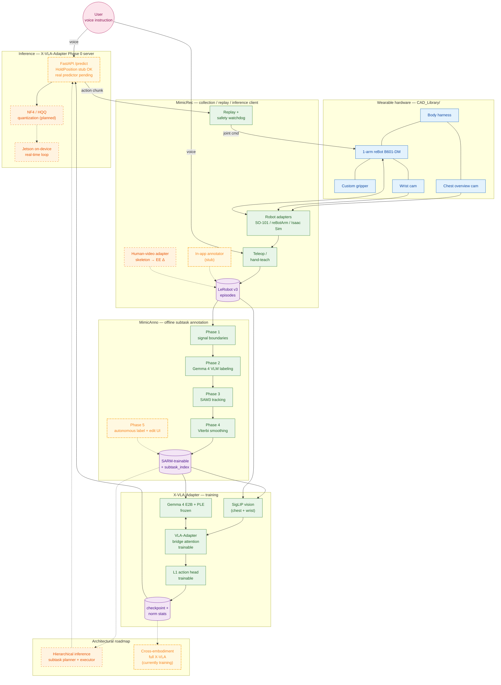
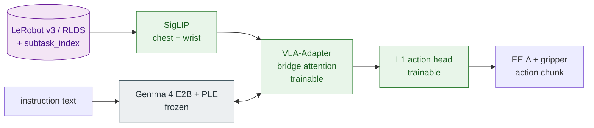

# vla-gemma-4

**English** | [日本語](README.ja.md)

> Wearable Vision-Language-Action assistant on Gemma 4 — a hands-free companion arm prototype for people with limb or visual impairments.

<!-- TODO: docs/images/hero.gif — wearable demo hero -->

## TL;DR

- **What**: A wearable VLA assistant — voice in, action out — built around Gemma 4.
- **Why Gemma 4 + VLA-Adapter**: PLE × VLA-Adapter bridge attention is a unique architectural fit; the LLM stays frozen and only a small adapter / projector / action head is trained → short-window efficient adaptation. An E2B-class open-weight LLM brings on-device offline inference (Jetson) within reach.
- **What works today**: LIBERO-Spatial 94 % in simulation (X-VLA-Adapter v33), plus operator-supervised scripted demos of three real-robot tasks (take from shelf / open lid / hold).
- **How to evaluate in 5 minutes**:
  1. Watch the demo media in [Demo / What it does today](#demo--what-it-does-today)
  2. Read the architecture in [System overview](#system-overview)
  3. Skim [Why Gemma 4 + VLA-Adapter](#why-gemma-4--vla-adapter)
  4. Verify LIBERO 94 % via [Reproducibility](#reproducibility)

## Mission

People with limb or visual impairments need *another arm* — something that can take a cup down from a shelf, open a lid, or hold an object steady, on demand.

We are building exactly that: a single arm worn on the body, with a chest-mounted overview camera and a wrist camera, taking voice instructions in natural language and acting on the physical world while sharing what it sees with the user. The design intent is **semi-autonomous companionship**, not full autonomy — the system extends the user's intent, it does not replace it.

We believe this is the moment to attempt it. Gemma 4's open-weight, small-footprint, on-device performance, combined with VLA-Adapter (Wang et al., 2025) — which keeps the LLM frozen and trains only a small adapter — bring **short-window efficient adaptation** within reach. The ~1.5-month sprint of this hackathon was enough to converge on LIBERO-Spatial 94 %. *This is a research prototype with operator-supervised demos; it is not a medical device.*

## Demo / What it does today

> **Status note**: All real-robot demos shown are **operator-supervised scripted demos**. A physical e-stop and software watchdog are required for any session. GIFs / video links will be filled in as media becomes available.

### Representative tasks (operator-supervised scripted demo)

- **Take from shelf** — <!-- TODO: docs/images/demo_shelf.gif -->
- **Open lid** — <!-- TODO: docs/images/demo_lid.gif -->
- **Hold / support** — sustained assistance, our differentiator vs. typical VLA pick-and-place — <!-- TODO: docs/images/demo_hold.gif -->

### Sim benchmark

- **LIBERO-Spatial 94 %** — X-VLA-Adapter v33, 47 / 50 episodes, 50 episode/suite, 4 tasks × 50 steps
- Training curve: <!-- TODO: docs/images/v33_training_curve.png -->

### Reproducibility

| Artifact | Pointer |
|---|---|
| Train config | [`X-VLA-Adapter/configs/train/libero_spatial_v33.yaml`](./X-VLA-Adapter/configs/train/libero_spatial_v33.yaml) |
| Eval config | [`X-VLA-Adapter/configs/eval/libero_v33_step40000.yaml`](./X-VLA-Adapter/configs/eval/libero_v33_step40000.yaml) |
| Checkpoint | <!-- TODO: HF Hub or Drive direct link --> |
| Eval command | `uv run python scripts/eval.py configs/eval/libero_v33_step40000.yaml` (run from `X-VLA-Adapter/`) |
| Hardware / SW | RTX 6000 Ada / Ubuntu 22.04 / CUDA 12.6 / Python 3.12 / `uv` lockfile committed |
| Normalization stats | Distributed alongside the checkpoint (`norm_stats.json`) |
| Model card | <!-- TODO: link to model card with limitations section --> |

## System overview

> Legend: green solid = shipped / yellow dot-dash = in-progress (stub / smoke / training) / orange dashed = planned / blue = hardware / purple = data store / pink = actor.
> Edges: solid = working path, dotted = path leading into in-progress or planned destinations.

Primary data flows: (1) user voice → MimicRec inference client → X-VLA-Adapter Phase 0 server, (2) chest + wrist cameras → SigLIP → VLA-Adapter bridge attention with frozen Gemma 4 → action head → 1-arm replay, (3) data loop: episodes collected by MimicRec → annotated by MimicAnno → fed back to X-VLA-Adapter for re-training. On-device offline operation (Jetson class) is the **target**; training currently runs on cloud or on-prem GPU.

<!-- Optional: docs/images/system_architecture.png — a more polished hand-drawn architecture diagram, when available -->

## Why Gemma 4 + VLA-Adapter

Where Gemma 4 runs in this project:

| Where | What |
|---|---|
| `X-VLA-Adapter` | The VLA backbone (E2B) at inference time; vision / action tokens are injected into each layer via bridge attention |
| `MimicAnno` Phase 2 | Image-text-to-text VLM that labels the subtask phase of each segment offline |
| Multilingual instructions | Natural language instructions in both Japanese and English are passed in directly |

Five reasons we chose this stack:

1. **Designed for offline on-device** — At E2B, Gemma 4 is in reach of Jetson-class hardware. Training-time memory is compressed via `bitsandbytes` 8-bit AdamW (`X-VLA-Adapter/src/vla_project/training/optim.py`); inference-side NF4 / HQQ quantization and the Jetson real-time loop both remain on the **roadmap**.
2. **PLE × VLA-Adapter bridge attention** — Gemma 4's Per-Layer Embeddings sit at every layer; VLA-Adapter injects vision and action tokens into every layer through bridge attention. The two structures stack naturally on top of each other. Our PAD-placeholder-ID workaround for routing custom tokens through PLE is a concrete engineering contribution.
3. **Short-window efficient adaptation via VLA-Adapter** — VLA-Adapter (Wang et al., 2025) freezes the LLM and trains only a small adapter + projector + action head. For our timeline this means:
   - fine-tuning converges on hundreds-to-thousands of episodes, orders of magnitude cheaper than full fine-tune
   - transfer to new robot embodiments and new tasks is a matter of swapping adapters
   - combined with LoRA (r = 16 / 64), we ran a v3 → v37 architecture sweep within the ~1.5-month hackathon window
   - within that window (~46 days, ~10 days remaining at time of writing), v33 reaching LIBERO 94 % depended directly on this efficiency
4. **Broad world knowledge + multilingual** — object names, physical intuition, and bilingual (ja / en) instruction handling all serve as a generalization scaffold.
5. **Open weights** — LoRA, quantization, and architecture surgery are unrestricted. Our v25 → v37 architecture sweep (`X-VLA-Adapter/configs/train/`) depends on this.

## The stack — 4 components

### `X-VLA-Adapter/` — VLA model & training & inference

**Role**: SigLIP + Gemma4-E2B + per-domain projector + L1 action head — the VLA policy itself. LIBERO benchmark is the primary axis; the same repo also handles real-robot deployment.

**Capabilities**:
- Switch every architecture revision from a single train YAML (v3 → v37: LoRA / soft-prompt-in-LLM / wrist-into-LLM / DA-2-MLP / etc.)
- Auto-sweep 50 ep × 4 suites × N steps from a single eval YAML
- Phase 0 FastAPI inference server (compatible with the MimicRec `/predict` contract; HoldPosition stub today, real model predictor pending v36)
- 4-domain RLDS + LeRobot dataloader, shared Q99 statistics
- Layer-wise freezing, per-param-group LR coefficients, checkpoint resume
- (planned) NF4 / HQQ quantization, Jetson on-device real-time loop

**Design principles** (see `CLAUDE.md` in this submodule): strict separation between `data` / `models` / `policies` / `training` / `evaluation` / `deployment` / `robots`, fully config-driven, robust to overnight sweeps.

**Headline result**: LIBERO-Spatial v33 = 94 % (47 / 50).

**Internal flow**:

**Details**: → [`X-VLA-Adapter/README.md`](./X-VLA-Adapter/README.md)

### `MimicRec/` — local-first data collection web app

### `MimicAnno/` — offline subtask annotation

### `CAD_Library/` — wearable hardware

## Quickstart

## Safety & Scope

### Current safety measures

### Scope (what the project is, and is not)

## Status & Roadmap

### Shipped

### In progress

### Roadmap — NOT IMPLEMENTED

## Acknowledgements

## License
