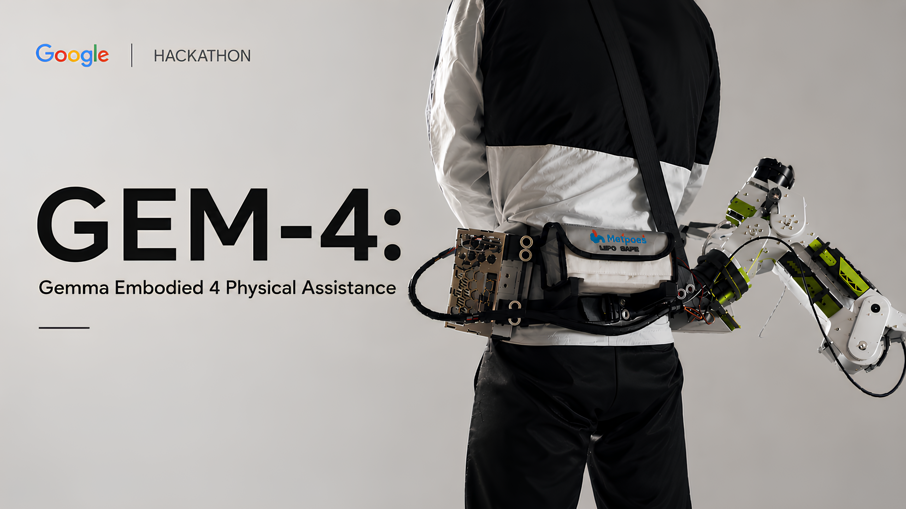
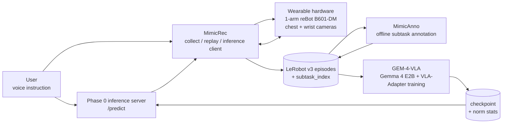

# vla-gemma-4

**English** | [日本語](README.ja.md)

> A Gemma 4-based wearable Vision-Language-Action assistant: a hands-free companion arm prototype that sees, understands voice instructions, and moves to help people with limb or visual impairments.

[](https://www.kaggle.com/competitions/gemma-4-good-hackathon/)
[](https://www.kaggle.com/models/google/gemma-4)




## Overview

A cup is just out of reach. A lid needs two hands. An object needs to be held steady for a few seconds. Small moments like these appear again and again in daily life. This project asks what it would take to have "another arm" present at exactly those moments.

We explore that idea as a wearable one-arm robot with a chest camera, a wrist camera, and natural-language voice instructions. The user says "take it," "open it," or "hold this." The system reads the intent, looks at the scene, and turns the request into a short physical action. The goal is **semi-autonomous assistance**: not a fully autonomous robot, but something closer to an extension of the user's own body and intent.

The technical bet is Gemma 4 + VLA-Adapter. In plain terms, this means connecting a language model to camera observations and robot actions without retraining the whole language model. That efficiency mattered: within a short hackathon sprint, we could iterate, recover from failed experiments, and reach **LIBERO-Spatial 94%** in simulation. The inference stack also runs on Jetson, making offline on-device use possible without depending on the cloud.

This is a research prototype with operator-supervised demos. It is **not** a medical device or certified assistive device.

## What Is VLA?

**Vision-Language-Action (VLA)** is a robot policy that connects three things:

- **Vision**: what the cameras see.
- **Language**: what the user asks for, such as "open the lid" or "hold this."
- **Action**: the robot motion to execute next.

For this project, VLA is the bridge from a user's instruction and camera images to short robot action chunks. It is not a fully autonomous household robot; it is a learned controller inside a supervised assistive system.

## Capabilities

- **A VLA policy can be trained and evaluated**: GEM-4-VLA v33 reaches **94%** on LIBERO-Spatial, 47 / 50 episodes. The setup freezes Gemma 4 and trains the smaller modules that connect vision, language, and action, making fast iteration possible within the hackathon window.
- **The VLA stack is built to expand across domains**: GEM-4-VLA is designed around multi-domain RLDS / LeRobot data, not a single benchmark-only path. Cross-embodiment / multi-domain X-VLA is part of the supported scope, making this the foundation for scaling to more robots and tasks.
- **Inference runs offline on Jetson**: the inference path can run on-device, without relying on a network connection. Camera and voice data can stay local, and decisions happen close to the body with lower latency.
- **There are real-robot demonstrations**: operator-supervised scripted demos cover take from shelf, open lid, and hold / support. The hold / support task is especially important because it points beyond one-shot pick-and-place toward sustained physical assistance.
- **MimicRec makes VLA data collection practical**: teleop, hand-teach, replay, review, LeRobot v3 export, and VLA `/predict` integration are brought into one local-first web app. It supports the loop of collecting demonstrations, inspecting them, checking success / failure, and connecting a VLA model for evaluation across real, mock, and sim setups.
- **MimicAnno turns raw episodes into richer training data**: it adds subtask boundaries and labels so trajectories are no longer just motion logs; they become structured demonstrations of what phase of the task is happening. That is the substrate for future hierarchical inference and longer-horizon task learning.
- **The hardware is part of the release**: the wearable arm prototype and CAD files live under `CAD_Library/`. This is not only a model repo; it is an end-to-end prototype covering the wearable setup, camera placement, data collection, annotation, training, and evaluation path.

All real-robot sessions require an operator, physical E-stop, and software watchdog.

<!-- TODO: add demo GIFs / videos:
- docs/images/demo_shelf.gif
- docs/images/demo_lid.gif
- docs/images/demo_hold.gif
- docs/images/v33_training_curve.png
-->

## Reproducibility

| Artifact | Pointer |
|---|---|
| Train config | [`GEM-4-VLA/configs/train/libero_spatial_v33.yaml`](./GEM-4-VLA/configs/train/libero_spatial_v33.yaml) |
| Eval config | [`GEM-4-VLA/configs/eval/libero_v33_step40000.yaml`](./GEM-4-VLA/configs/eval/libero_v33_step40000.yaml) |
| Eval command | `uv run python scripts/eval.py configs/eval/libero_v33_step40000.yaml` from `GEM-4-VLA/` |
| Hardware / SW | RTX 6000 Ada / Ubuntu 22.04 / CUDA 12.6 / Python 3.12 / `uv` lockfile |
| Checkpoint | <!-- TODO: HF Hub or Drive direct link --> |
| Normalization stats | Distributed alongside the checkpoint as `norm_stats.json` |
| Model card | <!-- TODO: link to model card with limitations section --> |

## System



Gemma 4 is used in two places:

| Where | Role |
|---|---|
| `GEM-4-VLA` | Main robot policy. It connects camera features, user instructions, and action outputs while keeping the Gemma 4 LLM frozen. |
| `MimicAnno` Phase 2 | Offline image-text-to-text VLM labeling for subtask phases. |

On-device offline inference on Jetson is supported, so the runtime path can avoid cloud dependency.

## Why Gemma 4 + VLA-Adapter

1. **Efficient adaptation**: the LLM stays frozen; only the small modules that connect language, images, and robot actions are trained.
2. **Good architectural fit**: Gemma 4's layer-wise structure works well with VLA-Adapter's way of injecting visual and action information into the model.
3. **Open weights**: LoRA, quantization, and architecture experiments are practical within the hackathon constraints.
4. **Multilingual and world-aware**: Japanese / English instructions, object names, and physical commonsense are useful for generalization.
5. **On-device execution**: E2B-size Gemma 4 plus the lightweight adapter setup enables offline inference on Jetson without depending on the cloud.

## Repository Layout

| Path | Role | Details |
|---|---|---|
| [`GEM-4-VLA/`](./GEM-4-VLA/README.md) | Robot policy model, training, evaluation, and inference server. Headline result: LIBERO-Spatial v33 = 94%. | [`README`](./GEM-4-VLA/README.md) |
| [`MimicRec/`](./MimicRec/README.md) | Local-first web app for teleop, hand-teach, replay, review, and LeRobot v3 dataset export. | [`README`](./MimicRec/README.md) |
| [`MimicAnno/`](./MimicAnno/README.md) | Offline pipeline for subtask boundary detection, Gemma 4 VLM labeling, SAM3 tracking, Viterbi smoothing, and export. | [`README`](./MimicAnno/README.md) |
| `CAD_Library/` | Wearable hardware CAD: arm, gripper, harness, and camera / data-collection fixtures. | SolidWorks / STEP files via git-lfs |

## Quickstart

```bash
git clone --recurse-submodules <url> && cd vla-gemma-4
git submodule update --init --recursive   # if --recurse-submodules was omitted
git lfs install && git lfs pull            # fetch CAD_Library STEP / SLDASM files
```

Then choose the relevant entry point:

| Goal | Start here |
|---|---|
| Train / evaluate on LIBERO | [`GEM-4-VLA/README.md`](./GEM-4-VLA/README.md) |
| Collect or replay robot data | [`MimicRec/README.md`](./MimicRec/README.md) |
| Annotate an existing dataset | [`MimicAnno/README.md`](./MimicAnno/README.md) |

There is no root-level end-to-end command yet. Each submodule README is the source of truth for its own runtime.

**Prerequisites**: Ubuntu 22.04 / 24.04, Python 3.12, Node 20+ for the MimicRec frontend, NVIDIA GPU + CUDA 12.6+ for GEM-4-VLA training. macOS / WSL may work for some components but is unverified.

## Safety & Scope

- This is a **research prototype**, not a medical device or certified assistive device.
- Real-robot demos are **operator-supervised** and require a physical E-stop plus software watchdog.
- Unsupervised home deployment is explicitly out of scope.
- Runtime camera and voice data stay on-device by default; Jetson offline inference performs no cloud upload.
- The intended assistance is short-horizon, single-task manipulation while a human can stop the system.
- We do not claim accessibility certification, regulatory approval, or clinical efficacy.

## Status & Roadmap

**Shipped**

- LIBERO-Spatial 94% with GEM-4-VLA v33.
- Operator-supervised scripted demos for take from shelf, open lid, and hold / support.
- MimicRec collect / review / replay flow on SO-101, reBot Arm, and Isaac Sim.
- MimicAnno Phase 1-4 annotation pipeline.
- VLA `/predict` contract and MimicRec client wiring, with a HoldPosition stub available for wire tests.
- Jetson on-device offline inference.
- Wearable CAD prototype in `CAD_Library/`.

**Covered in this repo**

- Checkpoint-backed real model prediction is handled in the GEM-4-VLA inference path.
- Cross-embodiment / multi-domain X-VLA is handled as part of the GEM-4-VLA training and evaluation scope.
- MimicAnno Phase 5 autonomous labeling and edit UI are handled as part of the MimicAnno expansion scope.

**Roadmap, not implemented**

The next goal is not merely to make a robot arm move. It is to make assistance feel close enough to the body that the user can express intent in a few words, let the system adapt from demonstrations, and make the on-device inference path faster, lighter, and more natural for daily use.

- **Scale demonstrations**: a human first-person video adapter that converts hand motion and grasp cues into robot-trainable action data.
- **Scale the VLA**: move from LIBERO to real robots, from one embodiment to cross-embodiment / multi-domain learning, and grow the task set by swapping data and adapters.
- **Handle longer tasks**: hierarchical inference with MimicAnno subtasks, separating a high-level planner from the low-level controller that moves the arm.
- **Make wearable inference lighter**: NF4 / HQQ quantization and related optimization for faster, lower-memory Jetson on-device inference.
- **Grow toward safe real-world assistance**: starting from short supervised tasks, then expanding toward more natural chains of everyday actions under E-stop, watchdog, and operator supervision.

## Acknowledgements

- **Hackathon**: [The Gemma 4 Good Hackathon](https://www.kaggle.com/competitions/gemma-4-good-hackathon/) - Kaggle x Google DeepMind, 2026-04-02 to 2026-05-18
- **Upstream**: VLA-Adapter (Wang et al., 2025), X-VLA, SigLIP, Gemma 4, LeRobot, SAM3, LIBERO

## License

- Root repository: **Apache-2.0** (see [`LICENSE`](./LICENSE))
- Submodules (`MimicRec`, `MimicAnno`, `GEM-4-VLA`): **Apache-2.0**
- `CAD_Library/` SLDPRT / SLDASM / STEP files: governed by the root license
- Upstream libraries retain their own licenses
