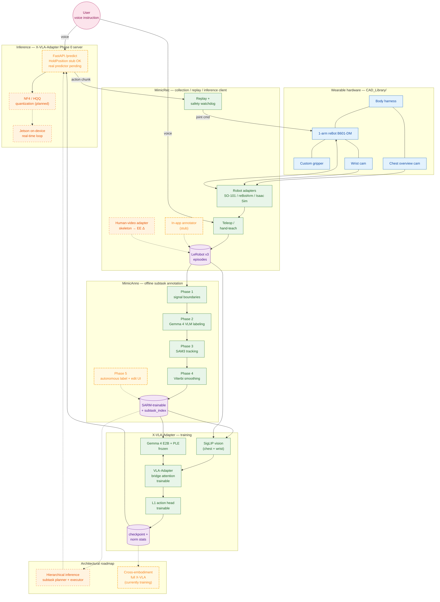
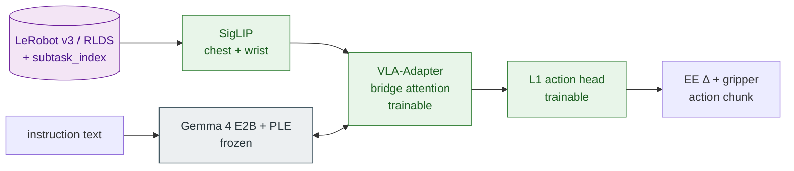
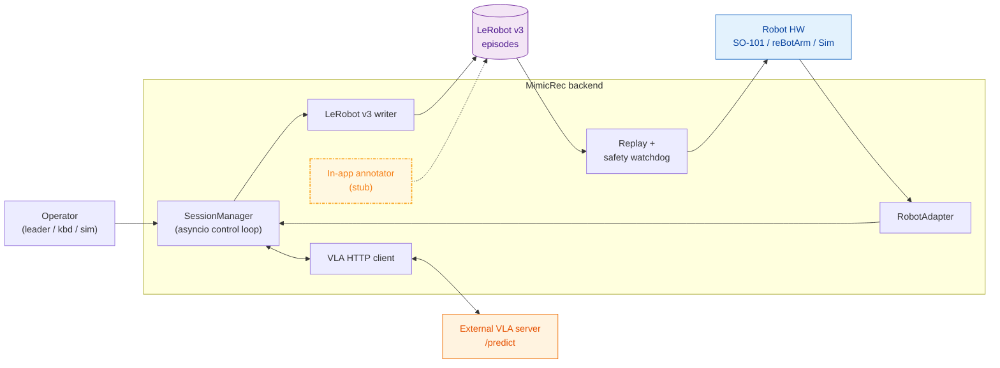
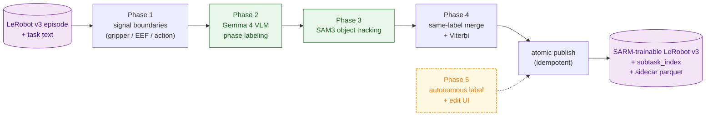

# vla-gemma-4 README Implementation Plan

> **For agentic workers:** REQUIRED SUB-SKILL: Use superpowers:subagent-driven-development (recommended) or superpowers:executing-plans to implement this plan task-by-task. Steps use checkbox (`- [ ]`) syntax for tracking.

**Goal:** Write `README.md` (English) and `README.ja.md` (Japanese) at the root of `vla-gemma-4/`, both following the spec at `docs/superpowers/specs/2026-05-08-vla-gemma-4-readme-design.md`. Each file is a self-contained landing page for the Gemma 4 Good Hackathon submission, an OSS onboarding hub, and a 5-minute pitch.

**Architecture:** One section at a time, en + ja in lockstep. Mermaid diagrams are validated with `mmdc` before commit. Image / video / checkpoint URLs are left as `<!-- TODO: ... -->` placeholders. Every section commit must keep both files in claims-parity.

**Tech Stack:** GitHub-flavored Markdown, Mermaid 10.x (rendered server-side by GitHub), `@mermaid-js/mermaid-cli` (`mmdc`) for local syntax validation, `git-lfs` for CAD assets (already configured), shields.io for badges.

---

## File Structure

| File | Responsibility |
|---|---|
| `README.md` (new) | English landing page. SoT for English text. Links to all submodule READMEs. |
| `README.ja.md` (new) | Japanese landing page. Same structure as `README.md`, claims-parity. |
| `docs/images/.gitkeep` (new) | Placeholder directory for hero / demo gifs / system architecture image (added later). |
| `docs/superpowers/specs/2026-05-08-vla-gemma-4-readme-design.md` (existing) | Authoritative content guide. Read this whenever a task says "per spec §X". |

No other files are touched. No source code is modified. No submodule content is changed. All deep links resolve to existing files inside submodules.

---

## Conventions used in every task

- **Heading levels**: `#` for the title, `##` for top-level sections, `###` for sub-sections (e.g. each component under "The stack"), `####` for sub-sub-sections inside Safety / Demo if needed.
- **Image placeholders**: `<!-- TODO: docs/images/<filename>.<ext> — <one-line description> -->`. Always include the description so the value of the placeholder is visible without rendering.
- **Mermaid fencing**: GitHub renders `\`\`\`mermaid` blocks natively. Do NOT nest these inside other fenced blocks in the rendered README (only the spec uses 4-backtick nesting because it shows the source).
- **Submodule links**: relative paths only (`./MimicAnno/README.md`), so they work both on GitHub and locally.
- **Status tags**: every Status & Roadmap bullet starts with `**(shipped)**`, `**(in-progress)**`, or `**(planned)**` — matching the system overview mermaid.
- **Claims-parity rule**: en and ja must encode the same factual content, the same Mission / Safety strength, and the same Roadmap status. Do not soften disability framing in ja or harden it in en.
- **Commits**: one commit per task. Commit message: `docs(readme): <section>` for section tasks, `docs(readme): scaffold` for Task 1, `docs(readme): final pass` for Task 16. All commits include both `README.md` and `README.ja.md` when relevant.

---

## Task 1: Scaffold both files + image dir

**Goal**: Create the two README files with the full section header skeleton and the image placeholder dir, so subsequent tasks only fill in section bodies.

**Files:**
- Create: `vla-gemma-4/README.md`
- Create: `vla-gemma-4/README.ja.md`
- Create: `vla-gemma-4/docs/images/.gitkeep`

- [ ] **Step 1: Create the image dir placeholder**

```bash
mkdir -p /home/takakimaeda/vla-gemma-4/docs/images
touch /home/takakimaeda/vla-gemma-4/docs/images/.gitkeep
```

- [ ] **Step 2: Create `README.md` skeleton (English headers only)**

Write this exact content to `/home/takakimaeda/vla-gemma-4/README.md`:

````markdown
# vla-gemma-4

**English** | [日本語](README.ja.md)

<!-- TODO: docs/images/hero.gif — wearable demo hero -->

## TL;DR

## Mission

## Demo / What it does today

### Representative tasks (operator-supervised scripted demo)

### Sim benchmark

### Reproducibility

## System overview

## Why Gemma 4 + VLA-Adapter

## The stack — 4 components

### `X-VLA-Adapter/` — VLA model & training & inference

### `MimicRec/` — local-first data collection web app

### `MimicAnno/` — offline subtask annotation

### `CAD_Library/` — wearable hardware

## Quickstart

## Safety & Scope

### Current safety measures

### Scope (what the project is, and is not)

## Status & Roadmap

### Shipped

### In progress

### Roadmap — NOT IMPLEMENTED

## Acknowledgements

## License
````

- [ ] **Step 3: Create `README.ja.md` skeleton (mirror structure, Japanese-flavored)**

Write this exact content to `/home/takakimaeda/vla-gemma-4/README.ja.md`:

````markdown
# vla-gemma-4

[English](README.md) | **日本語**

<!-- TODO: docs/images/hero.gif — 装着デモ ヒーロー -->

## TL;DR

## Mission

## Demo / What it does today

### 代表タスク (operator-supervised scripted demo)

### Sim benchmark

### Reproducibility

## System overview

## Why Gemma 4 + VLA-Adapter

## The stack — 4 components

### `X-VLA-Adapter/` — VLA モデル / 学習 / 推論

### `MimicRec/` — local-first データ収集 Web アプリ

### `MimicAnno/` — オフライン subtask アノテーション

### `CAD_Library/` — ウェアラブルハードウェア

## Quickstart

## Safety & Scope

### 現状の安全措置

### Scope (何であって何でないか)

## Status & Roadmap

### Shipped

### In progress

### Roadmap — NOT IMPLEMENTED

## Acknowledgements

## License
````

- [ ] **Step 4: Verify both files exist and section count matches**

Run:
```bash
diff <(grep -c '^##' /home/takakimaeda/vla-gemma-4/README.md) <(grep -c '^##' /home/takakimaeda/vla-gemma-4/README.ja.md)
```
Expected: empty output (= equal counts).

- [ ] **Step 5: Commit**

```bash
cd /home/takakimaeda/vla-gemma-4
git add README.md README.ja.md docs/images/.gitkeep
git commit -m "$(cat <<'EOF'
docs(readme): scaffold root README.md / README.ja.md skeletons

Skeleton headers only; subsequent commits fill section bodies. Image
placeholder dir docs/images/ established.

Co-Authored-By: Claude Opus 4.7 (1M context) <noreply@anthropic.com>
EOF
)"
```

---

## Task 2: Header — title, pitch, badges, hero, language toggle

**Goal**: Replace the bare title block with full Header per spec §4.0.

**Files:**
- Modify: `README.md` (top of file, lines ~1-5)
- Modify: `README.ja.md` (top of file, lines ~1-5)

- [ ] **Step 1: Replace top of `README.md` with the English Header**

Use Edit to replace:
```
# vla-gemma-4

**English** | [日本語](README.ja.md)

<!-- TODO: docs/images/hero.gif — wearable demo hero -->
```

with:

```markdown
# vla-gemma-4

**English** | [日本語](README.ja.md)

> Wearable Vision-Language-Action assistant on Gemma 4 — a hands-free companion arm prototype for people with limb or visual impairments.

[](https://www.kaggle.com/competitions/gemma-4-good-hackathon/)
[](https://www.kaggle.com/models/google/gemma-4)


<!-- TODO: docs/images/hero.gif — wearable demo hero -->
```

- [ ] **Step 2: Replace top of `README.ja.md` with the Japanese Header**

Use Edit to replace:
```
# vla-gemma-4

[English](README.md) | **日本語**

<!-- TODO: docs/images/hero.gif — 装着デモ ヒーロー -->
```

with:

```markdown
# vla-gemma-4

[English](README.md) | **日本語**

> Gemma 4 をバックボーンとした、ハンズフリー・視覚共有のウェアラブル相棒アーム — 腕や視覚に不自由のある方の日常を補助するプロトタイプ。

[](https://www.kaggle.com/competitions/gemma-4-good-hackathon/)
[](https://www.kaggle.com/models/google/gemma-4)


<!-- TODO: docs/images/hero.gif — 装着デモ ヒーロー -->
```

- [ ] **Step 3: Verify identical badge URLs in both files**

Run:
```bash
diff <(grep -E '^\[!\[|^!\[' /home/takakimaeda/vla-gemma-4/README.md) <(grep -E '^\[!\[|^!\[' /home/takakimaeda/vla-gemma-4/README.ja.md)
```
Expected: empty output.

- [ ] **Step 4: Commit**

```bash
cd /home/takakimaeda/vla-gemma-4
git add README.md README.ja.md
git commit -m "docs(readme): header — pitch, badges, hero placeholder, language toggle"
```

---

## Task 3: TL;DR

**Goal**: 4-bullet section that lets a judge evaluate the project in 5 minutes.

**Files:**
- Modify: `README.md` — fill body under `## TL;DR`
- Modify: `README.ja.md` — fill body under `## TL;DR`

- [ ] **Step 1: Add the English TL;DR body**

Use Edit on `README.md` to replace:
```
## TL;DR

## Mission
```

with:

```markdown
## TL;DR

- **What**: A wearable VLA assistant — voice in, action out — built around Gemma 4.
- **Why Gemma 4 + VLA-Adapter**: PLE × VLA-Adapter bridge attention is a unique architectural fit; the LLM stays frozen and only a small adapter / projector / action head is trained → short-window efficient adaptation. An E2B-class open-weight LLM brings on-device offline inference (Jetson) within reach.
- **What works today**: LIBERO-Spatial 94 % in simulation (X-VLA-Adapter v33), plus operator-supervised scripted demos of three real-robot tasks (take from shelf / open lid / hold).
- **How to evaluate in 5 minutes**:
  1. Watch the demo media in [Demo / What it does today](#demo--what-it-does-today)
  2. Read the architecture in [System overview](#system-overview)
  3. Skim [Why Gemma 4 + VLA-Adapter](#why-gemma-4--vla-adapter)
  4. Verify LIBERO 94 % via [Reproducibility](#reproducibility)

## Mission
```

- [ ] **Step 2: Add the Japanese TL;DR body**

Use Edit on `README.ja.md` to replace:
```
## TL;DR

## Mission
```

with:

```markdown
## TL;DR

- **このプロジェクト**: 音声で話しかけ、行動で応える、Gemma 4 ベースのウェアラブル VLA アシスタント。
- **なぜ Gemma 4 + VLA-Adapter か**: PLE × VLA-Adapter の bridge attention は他に類を見ないアーキ整合性をもち、 LLM 本体は凍結、 小さな adapter / projector / action head のみを学習する → 短期間での効率的な適応。 E2B クラスのオープンウェイト LLM だから on-device オフライン推論 (Jetson) も射程に入れた。
- **現在動く範囲**: シミュレーションで LIBERO-Spatial 94 % (X-VLA-Adapter v33)、 加えて実機 3 タスク (棚から取る / フタを開ける / 支える) の operator-supervised scripted demo。
- **5 分で評価するなら**:
  1. デモのメディアを見る → [Demo / What it does today](#demo--what-it-does-today)
  2. アーキを読む → [System overview](#system-overview)
  3. [Why Gemma 4 + VLA-Adapter](#why-gemma-4--vla-adapter) を流し読み
  4. LIBERO 94 % の根拠を確認 → [Reproducibility](#reproducibility)

## Mission
```

- [ ] **Step 3: Commit**

```bash
cd /home/takakimaeda/vla-gemma-4
git add README.md README.ja.md
git commit -m "docs(readme): TL;DR — 5-minute eval path for hackathon judges"
```

---

## Task 4: Mission

**Goal**: 3-paragraph narrative — who it's for, what we build, why now.

**Files:**
- Modify: `README.md` — fill body under `## Mission`
- Modify: `README.ja.md` — fill body under `## Mission`

- [ ] **Step 1: Add the English Mission body**

Use Edit on `README.md` to replace:
```
## Mission

## Demo / What it does today
```

with:

```markdown
## Mission

People with limb or visual impairments need *another arm* — something that can take a cup down from a shelf, open a lid, or hold an object steady, on demand.

We are building exactly that: a single arm worn on the body, with a chest-mounted overview camera and a wrist camera, taking voice instructions in natural language and acting on the physical world while sharing what it sees with the user. The design intent is **semi-autonomous companionship**, not full autonomy — the system extends the user's intent, it does not replace it.

We believe this is the moment to attempt it. Gemma 4's open-weight, small-footprint, on-device performance, combined with VLA-Adapter (Wang et al., 2025) — which keeps the LLM frozen and trains only a small adapter — bring **short-window efficient adaptation** within reach. The ~1.5-month sprint of this hackathon was enough to converge on LIBERO-Spatial 94 %. *This is a research prototype with operator-supervised demos; it is not a medical device.*

## Demo / What it does today
```

- [ ] **Step 2: Add the Japanese Mission body**

Use Edit on `README.ja.md` to replace:
```
## Mission

## Demo / What it does today
```

with:

```markdown
## Mission

腕や視覚に不自由のある方は、 「もう一本の腕」 を必要としている — 棚からコップを取りたい、 フタを開けたい、 物を支えていてほしい、 そういう日常の所作を、 必要なタイミングで頼める腕を。

私たちが作っているのはまさにそれ。 体に装着できる 1 本のアーム、 胸の俯瞰カメラと wrist カメラ、 自然言語の音声指示を受け取り、 視覚をユーザーと共有しながら物理世界に作用する。 設計思想は **semi-autonomous な相棒** — 完全自律ではなく、 ユーザーの意図を拡張し、 補助する。

なぜ今か。 Gemma 4 のオープンウェイト・小型・on-device 性能と、 VLA-Adapter (Wang et al., 2025) の LLM 凍結 + 小さな adapter のみ学習する手法が組み合わさって、 **短期間・効率的な適応**が現実的射程に入った。 約 1.5 ヶ月のハッカソンスプリントでも LIBERO-Spatial 94 % まで到達できる。 *これは operator-supervised の研究プロトタイプであり、 医療機器ではありません。*

## Demo / What it does today
```

- [ ] **Step 3: Verify both Mission sections mention "research prototype" / "研究プロトタイプ" + "not a medical device" / "医療機器ではありません"**

Run:
```bash
grep -E "research prototype.*medical device|operator-supervised" /home/takakimaeda/vla-gemma-4/README.md
grep -E "研究プロトタイプ|医療機器" /home/takakimaeda/vla-gemma-4/README.ja.md
```
Expected: at least one match per file (the disclaimers are present).

- [ ] **Step 4: Commit**

```bash
cd /home/takakimaeda/vla-gemma-4
git add README.md README.ja.md
git commit -m "docs(readme): mission — who it's for, what we build, why now"
```

---

## Task 5: Demo / What it does today (incl. Reproducibility)

**Goal**: Demo task list, sim benchmark headline, reproducibility table.

**Files:**
- Modify: `README.md`
- Modify: `README.ja.md`

- [ ] **Step 1: Add the English Demo body**

Use Edit on `README.md` to replace the empty block:
```
## Demo / What it does today

### Representative tasks (operator-supervised scripted demo)

### Sim benchmark

### Reproducibility

## System overview
```

with:

```markdown
## Demo / What it does today

> **Status note**: All real-robot demos shown are **operator-supervised scripted demos**. A physical e-stop and software watchdog are required for any session. GIFs / video links will be filled in as media becomes available.

### Representative tasks (operator-supervised scripted demo)

- **Take from shelf** — <!-- TODO: docs/images/demo_shelf.gif -->
- **Open lid** — <!-- TODO: docs/images/demo_lid.gif -->
- **Hold / support** — sustained assistance, our differentiator vs. typical VLA pick-and-place — <!-- TODO: docs/images/demo_hold.gif -->

### Sim benchmark

- **LIBERO-Spatial 94 %** — X-VLA-Adapter v33, 47 / 50 episodes, 50 episode/suite, 4 tasks × 50 steps
- Training curve: <!-- TODO: docs/images/v33_training_curve.png -->

### Reproducibility

| Artifact | Pointer |
|---|---|
| Train config | [`X-VLA-Adapter/configs/train/libero_spatial_v33.yaml`](./X-VLA-Adapter/configs/train/libero_spatial_v33.yaml) |
| Eval config | [`X-VLA-Adapter/configs/eval/libero_v33_step40000.yaml`](./X-VLA-Adapter/configs/eval/libero_v33_step40000.yaml) |
| Checkpoint | <!-- TODO: HF Hub or Drive direct link --> |
| Eval command | `uv run python scripts/eval.py configs/eval/libero_v33_step40000.yaml` (run from `X-VLA-Adapter/`) |
| Hardware / SW | RTX 6000 Ada / Ubuntu 22.04 / CUDA 12.6 / Python 3.12 / `uv` lockfile committed |
| Normalization stats | Distributed alongside the checkpoint (`norm_stats.json`) |
| Model card | <!-- TODO: link to model card with limitations section --> |

## System overview
```

- [ ] **Step 2: Add the Japanese Demo body**

Use Edit on `README.ja.md` to replace the empty block:
```
## Demo / What it does today

### 代表タスク (operator-supervised scripted demo)

### Sim benchmark

### Reproducibility

## System overview
```

with:

```markdown
## Demo / What it does today

> **状態の注釈**: 以下の実機デモはすべて **operator-supervised の scripted demo** です。 物理 e-stop とソフトウェア watchdog の併用がセッション必須前提。 GIF / 動画はファイルが揃い次第差し替えます。

### 代表タスク (operator-supervised scripted demo)

- **棚から取る** — <!-- TODO: docs/images/demo_shelf.gif -->
- **フタを開ける** — <!-- TODO: docs/images/demo_lid.gif -->
- **支える / 持つ** — 持続的アシスト。 一般的な VLA pick-and-place との差別化点 — <!-- TODO: docs/images/demo_hold.gif -->

### Sim benchmark

- **LIBERO-Spatial 94 %** — X-VLA-Adapter v33、 47 / 50 episodes、 50 episode/suite、 4 タスク × 50 step
- 学習曲線: <!-- TODO: docs/images/v33_training_curve.png -->

### Reproducibility

| Artifact | Pointer |
|---|---|
| 学習 config | [`X-VLA-Adapter/configs/train/libero_spatial_v33.yaml`](./X-VLA-Adapter/configs/train/libero_spatial_v33.yaml) |
| Eval config | [`X-VLA-Adapter/configs/eval/libero_v33_step40000.yaml`](./X-VLA-Adapter/configs/eval/libero_v33_step40000.yaml) |
| Checkpoint | <!-- TODO: HF Hub または Drive 直リンク --> |
| Eval コマンド | `uv run python scripts/eval.py configs/eval/libero_v33_step40000.yaml` (`X-VLA-Adapter/` 配下で実行) |
| ハードウェア / SW | RTX 6000 Ada / Ubuntu 22.04 / CUDA 12.6 / Python 3.12 / `uv` lockfile committed |
| 正規化統計 | checkpoint と同梱 (`norm_stats.json`) |
| Model card | <!-- TODO: 限界・既知の挙動を含む model card へのリンク --> |

## System overview
```

- [ ] **Step 3: Verify referenced submodule files exist**

Run:
```bash
test -f /home/takakimaeda/vla-gemma-4/X-VLA-Adapter/configs/train/libero_spatial_v33.yaml && echo OK1
test -f /home/takakimaeda/vla-gemma-4/X-VLA-Adapter/configs/eval/libero_v33_step40000.yaml && echo OK2
```
Expected: `OK1` and `OK2`.

- [ ] **Step 4: Commit**

```bash
cd /home/takakimaeda/vla-gemma-4
git add README.md README.ja.md
git commit -m "docs(readme): demo + reproducibility — LIBERO 94% + 3 real-robot tasks"
```

---

## Task 6: System overview (mermaid + caption)

**Goal**: Drop the validated system-overview mermaid from spec §4.4 plus a short caption.

**Files:**
- Modify: `README.md`
- Modify: `README.ja.md`

- [ ] **Step 1: Save the system overview mermaid source for validation**

Write this exact content to `/tmp/sys_overview.mmd`:

```
flowchart TB
    User(("User<br/>voice instruction"))

    subgraph HW["Wearable hardware — CAD_Library/"]
        direction LR
        Harness["Body harness"]
        Arm["1-arm reBot B601-DM"]
        Gripper["Custom gripper"]
        ChestCam["Chest overview cam"]
        WristCam["Wrist cam"]
        Harness --- Arm
        Harness --- ChestCam
        Arm --- Gripper
        Arm --- WristCam
    end

    subgraph DC["MimicRec — collection / replay / inference client"]
        direction TB
        MR_Adapter["Robot adapters<br/>SO-101 / reBotArm / Isaac Sim"]
        MR_Teleop["Teleop /<br/>hand-teach"]
        MR_Replay["Replay +<br/>safety watchdog"]
        MR_StubAnno["In-app annotator<br/>(stub)"]
        MR_HumanAdapter["Human-video adapter<br/>skeleton → EE Δ"]
        MR_Out[("LeRobot v3<br/>episodes")]
        MR_Adapter --> MR_Teleop --> MR_Out
        MR_StubAnno -.-> MR_Out
        MR_HumanAdapter -.-> MR_Out
    end

    subgraph ANNO["MimicAnno — offline subtask annotation"]
        direction TB
        MA_P1["Phase 1<br/>signal boundaries"]
        MA_P2["Phase 2<br/>Gemma 4 VLM labeling"]
        MA_P3["Phase 3<br/>SAM3 tracking"]
        MA_P4["Phase 4<br/>Viterbi smoothing"]
        MA_P5["Phase 5<br/>autonomous label + edit UI"]
        MA_Out[("SARM-trainable<br/>+ subtask_index")]
        MA_P1 --> MA_P2 --> MA_P3 --> MA_P4 --> MA_Out
        MA_P5 -.-> MA_Out
    end

    subgraph TRAIN["X-VLA-Adapter — training"]
        direction TB
        T_Vision["SigLIP vision<br/>(chest + wrist)"]
        T_Gemma["Gemma 4 E2B + PLE<br/>frozen"]
        T_Adapter["VLA-Adapter<br/>bridge attention<br/>trainable"]
        T_Head["L1 action head<br/>trainable"]
        T_Ckpt[("checkpoint +<br/>norm stats")]
        T_Vision --> T_Adapter
        T_Gemma <--> T_Adapter
        T_Adapter --> T_Head --> T_Ckpt
    end

    subgraph INFER["Inference — X-VLA-Adapter Phase 0 server"]
        direction LR
        I_API["FastAPI /predict<br/>HoldPosition stub OK<br/>real predictor pending"]
        I_Quant["NF4 / HQQ<br/>quantization (planned)"]
        I_Jetson["Jetson on-device<br/>real-time loop"]
        I_API --> I_Quant -.-> I_Jetson
    end

    subgraph FUTURE["Architectural roadmap"]
        direction TB
        R_Hier["Hierarchical inference<br/>subtask planner + executor"]
        R_Cross["Cross-embodiment<br/>full X-VLA<br/>(currently training)"]
    end

    User -- voice --> I_API
    User -- voice --> MR_Teleop
    ChestCam --> MR_Adapter
    WristCam --> MR_Adapter
    Arm <--> MR_Adapter

    MR_Out --> MA_P1
    MA_Out --> T_Vision
    MA_Out --> T_Gemma
    MR_Out --> T_Vision

    T_Ckpt --> I_API
    I_API -- action chunk --> MR_Replay
    MR_Replay -- joint cmd --> Arm

    MA_Out -.-> R_Hier
    R_Hier -.-> I_API
    T_Ckpt -.-> R_Cross

    classDef shipped fill:#e8f5e9,stroke:#2e7d32,color:#1b5e20
    classDef inprogress fill:#fff8e1,stroke:#f9a825,color:#f57f17,stroke-dasharray:5 2 2 2,stroke-width:2px
    classDef planned fill:#fff3e0,stroke:#ef6c00,color:#e65100,stroke-dasharray:5 5
    classDef hardware fill:#e3f2fd,stroke:#1565c0,color:#0d47a1
    classDef data fill:#f3e5f5,stroke:#6a1b9a,color:#4a148c
    classDef actor fill:#fce4ec,stroke:#ad1457,color:#880e4f

    class User actor
    class Harness,Arm,Gripper,ChestCam,WristCam hardware
    class MR_Adapter,MR_Teleop,MR_Replay,MA_P1,MA_P2,MA_P3,MA_P4,T_Vision,T_Gemma,T_Adapter,T_Head shipped
    class I_API,R_Cross,MA_P5,MR_StubAnno inprogress
    class MR_HumanAdapter,I_Quant,I_Jetson,R_Hier planned
    class MR_Out,MA_Out,T_Ckpt data
```

- [ ] **Step 2: Validate mermaid renders**

Run:
```bash
npx -y -p @mermaid-js/mermaid-cli mmdc -i /tmp/sys_overview.mmd -o /tmp/sys_overview.png 2>&1 | tail -3
ls -la /tmp/sys_overview.png
```
Expected: `Generating single mermaid chart` (no errors), PNG file > 10 KB.

- [ ] **Step 3: Add the English System overview body**

Use Edit on `README.md` to replace:
```
## System overview

## Why Gemma 4 + VLA-Adapter
```

with this block exactly (the mermaid body is the same content saved to `/tmp/sys_overview.mmd` in Step 1, inlined here so the README is self-contained):

`````markdown
## System overview

> Legend: green solid = shipped / yellow dot-dash = in-progress (stub / smoke / training) / orange dashed = planned / blue = hardware / purple = data store / pink = actor.
> Edges: solid = working path, dotted = path leading into in-progress or planned destinations.



Primary data flows: (1) user voice → MimicRec inference client → X-VLA-Adapter Phase 0 server, (2) chest + wrist cameras → SigLIP → VLA-Adapter bridge attention with frozen Gemma 4 → action head → 1-arm replay, (3) data loop: episodes collected by MimicRec → annotated by MimicAnno → fed back to X-VLA-Adapter for re-training. On-device offline operation (Jetson class) is the **target**; training currently runs on cloud or on-prem GPU.

<!-- Optional: docs/images/system_architecture.png — a more polished hand-drawn architecture diagram, when available -->

## Why Gemma 4 + VLA-Adapter
`````

- [ ] **Step 4: Add the Japanese System overview body**

Use Edit on `README.ja.md` to replace:
```
## System overview

## Why Gemma 4 + VLA-Adapter
```

with this block (Japanese caption, mermaid body byte-identical to Step 3):

`````markdown
## System overview

> 凡例: 緑 solid = shipped / 黄 dot-dash = in-progress (stub / smoke / 学習中) / 橙 dashed = planned / 青 = hardware / 紫 = data store / ピンク = actor。
> Edge: 実線 = 動作する経路、 点線 = in-progress または planned へ向かう経路。


主要なデータ流: (1) ユーザーの音声 → MimicRec (推論 client) → X-VLA-Adapter Phase 0 server、 (2) 胸の俯瞰カメラ + wrist カメラ → SigLIP → VLA-Adapter bridge attention で Gemma 4 (frozen) と対話 → action head → 1 アーム、 (3) データ収集ループ: MimicRec で集めた LeRobot v3 episode → MimicAnno で subtask アノテ → X-VLA-Adapter で再学習。 on-device offline 動作 (Jetson クラス) を **目標** とし、 学習はクラウド/オンプレ GPU。

<!-- 任意: docs/images/system_architecture.png — より洗練された装着写真ベースの図、 用意でき次第差し替え -->

## Why Gemma 4 + VLA-Adapter
`````

- [ ] **Step 5: Verify the mermaid block in each file is byte-identical**

Run:
```bash
diff <(awk '/^```mermaid$/,/^```$/' /home/takakimaeda/vla-gemma-4/README.md | head -120) <(awk '/^```mermaid$/,/^```$/' /home/takakimaeda/vla-gemma-4/README.ja.md | head -120)
```
Expected: empty output (the system overview mermaid is the first mermaid block in each file at this point in the workflow).

- [ ] **Step 6: Commit**

```bash
cd /home/takakimaeda/vla-gemma-4
git add README.md README.ja.md
git commit -m "docs(readme): system overview — mermaid relationship diagram"
```

---

## Task 7: Why Gemma 4 + VLA-Adapter

**Goal**: Where Gemma 4 runs in the stack (table) + 5 USP bullets.

**Files:**
- Modify: `README.md`
- Modify: `README.ja.md`

- [ ] **Step 1: Add the English body**

Use Edit on `README.md` to replace:
```
## Why Gemma 4 + VLA-Adapter

## The stack — 4 components
```

with:

```markdown
## Why Gemma 4 + VLA-Adapter

Where Gemma 4 runs in this project:

| Where | What |
|---|---|
| `X-VLA-Adapter` | The VLA backbone (E2B) at inference time; vision / action tokens are injected into each layer via bridge attention |
| `MimicAnno` Phase 2 | Image-text-to-text VLM that labels the subtask phase of each segment offline |
| Multilingual instructions | Natural language instructions in both Japanese and English are passed in directly |

Five reasons we chose this stack:

1. **Designed for offline on-device** — At E2B, Gemma 4 is in reach of Jetson-class hardware. Training-time memory is compressed via `bitsandbytes` 8-bit AdamW (`X-VLA-Adapter/src/vla_project/training/optim.py`); inference-side NF4 / HQQ quantization and the Jetson real-time loop both remain on the **roadmap**.
2. **PLE × VLA-Adapter bridge attention** — Gemma 4's Per-Layer Embeddings sit at every layer; VLA-Adapter injects vision and action tokens into every layer through bridge attention. The two structures stack naturally on top of each other. Our PAD-placeholder-ID workaround for routing custom tokens through PLE is a concrete engineering contribution.
3. **Short-window efficient adaptation via VLA-Adapter** — VLA-Adapter (Wang et al., 2025) freezes the LLM and trains only a small adapter + projector + action head. For our timeline this means:
   - fine-tuning converges on hundreds-to-thousands of episodes, orders of magnitude cheaper than full fine-tune
   - transfer to new robot embodiments and new tasks is a matter of swapping adapters
   - combined with LoRA (r = 16 / 64), we ran a v3 → v37 architecture sweep within the ~1.5-month hackathon window
   - within that window (~46 days, ~10 days remaining at time of writing), v33 reaching LIBERO 94 % depended directly on this efficiency
4. **Broad world knowledge + multilingual** — object names, physical intuition, and bilingual (ja / en) instruction handling all serve as a generalization scaffold.
5. **Open weights** — LoRA, quantization, and architecture surgery are unrestricted. Our v25 → v37 architecture sweep (`X-VLA-Adapter/configs/train/`) depends on this.

## The stack — 4 components
```

- [ ] **Step 2: Add the Japanese body**

Use Edit on `README.ja.md` to replace:
```
## Why Gemma 4 + VLA-Adapter

## The stack — 4 components
```

with:

```markdown
## Why Gemma 4 + VLA-Adapter

このプロジェクトで Gemma 4 が動いている場所:

| Where | What |
|---|---|
| `X-VLA-Adapter` | 推論時の VLA バックボーン (E2B)。 各層に bridge attention を介して視覚 / 動作トークンが注入される |
| `MimicAnno` Phase 2 | オフラインで segment ごとに subtask phase をラベリングする VLM (image-text-to-text) |
| 多言語指示 | 日英両言語の自然言語指示を直接食わせる |

このスタックを選んだ 5 つの理由:

1. **Designed for offline on-device** — E2B サイズで Jetson クラスを射程に入れる。 学習時は `bitsandbytes` 8-bit AdamW (`X-VLA-Adapter/src/vla_project/training/optim.py`) で memory 圧縮しているが、 推論側の NF4 / HQQ 量子化と Jetson real-time 推論ループはどちらも **Roadmap (未着手)**。
2. **PLE × VLA-Adapter bridge attention** — Gemma 4 の Per-Layer Embeddings は層ごとに存在し、 VLA-Adapter が各層に視覚 / 動作トークンを bridge attention で注入する設計と二段組で同居する。 本リポでは PAD placeholder ID を使って PLE 領域に custom token を流し込む engineering workaround も実装しており、 これが具体的な実装貢献。
3. **VLA-Adapter による短期間・効率的な適応** — VLA-Adapter (Wang et al., 2025) は LLM 本体を凍結し、 小さな adapter + projector + action head のみを学習する。 タイムラインへの影響:
   - 数百〜数千 episode で fine-tune が収束 (full fine-tune 比で桁違いに省コスト)
   - 新ロボット形態・新タスクへの転移が adapter 入替で効く
   - LoRA (r = 16 / 64) と組み合わせて約 1.5 ヶ月のハッカソン期間中に v3 → v37 まで sweep 可能だった
   - ハッカソン期間 (約 46 日、 残 10 日時点) で v33 が LIBERO 94 % に到達できたのはこの efficiency に直接依存している
4. **広範な世界知識 + 多言語** — オブジェクト名・物理直観・日英両言語の指示が generalize の足場になる。
5. **オープンウェイト** — LoRA / 量子化 / アーキ改造を自由に試せる。 v25 → v37 の architecture sweep (`X-VLA-Adapter/configs/train/`) はそれに依存している。

## The stack — 4 components
```

- [ ] **Step 3: Commit**

```bash
cd /home/takakimaeda/vla-gemma-4
git add README.md README.ja.md
git commit -m "docs(readme): why Gemma 4 + VLA-Adapter — usage table + 5 USP"
```

---

## Task 8: Component — `X-VLA-Adapter` (with mini mermaid)

**Goal**: First and longest of the 4 component sections. Role / capabilities / mini mermaid / detail link.

**Files:**
- Modify: `README.md`
- Modify: `README.ja.md`

- [ ] **Step 1: Extract X-VLA-Adapter mini mermaid from spec §4.6.1 to /tmp**

Use the spec at `docs/superpowers/specs/2026-05-08-vla-gemma-4-readme-design.md` §4.6.1 — the mermaid block is:

```
flowchart LR
    D[("LeRobot v3 / RLDS<br/>+ subtask_index")]
    I["instruction text"]
    V["SigLIP<br/>chest + wrist"]
    L["Gemma 4 E2B + PLE<br/>frozen"]
    A["VLA-Adapter<br/>bridge attention<br/>trainable"]
    H["L1 action head<br/>trainable"]
    O["EE Δ + gripper<br/>action chunk"]
    D --> V
    I --> L
    V --> A
    L <--> A
    A --> H --> O
    classDef frozen fill:#eceff1,stroke:#455a64,color:#263238
    classDef trainable fill:#e8f5e9,stroke:#2e7d32,color:#1b5e20
    classDef data fill:#f3e5f5,stroke:#6a1b9a,color:#4a148c
    class L frozen
    class V,A,H trainable
    class D data
```

Save to `/tmp/xvla_mini.mmd` and validate:
```bash
npx -y -p @mermaid-js/mermaid-cli mmdc -i /tmp/xvla_mini.mmd -o /tmp/xvla_mini.png 2>&1 | tail -3
ls -la /tmp/xvla_mini.png
```
Expected: `Generating single mermaid chart`, file > 10 KB.

- [ ] **Step 2: Add the English X-VLA-Adapter body**

Use Edit on `README.md` to replace:
```
### `X-VLA-Adapter/` — VLA model & training & inference

### `MimicRec/` — local-first data collection web app
```

with:

````markdown
### `X-VLA-Adapter/` — VLA model & training & inference

**Role**: SigLIP + Gemma4-E2B + per-domain projector + L1 action head — the VLA policy itself. LIBERO benchmark is the primary axis; the same repo also handles real-robot deployment.

**Capabilities**:
- Switch every architecture revision from a single train YAML (v3 → v37: LoRA / soft-prompt-in-LLM / wrist-into-LLM / DA-2-MLP / etc.)
- Auto-sweep 50 ep × 4 suites × N steps from a single eval YAML
- Phase 0 FastAPI inference server (compatible with the MimicRec `/predict` contract; HoldPosition stub today, real model predictor pending v36)
- 4-domain RLDS + LeRobot dataloader, shared Q99 statistics
- Layer-wise freezing, per-param-group LR coefficients, checkpoint resume
- (planned) NF4 / HQQ quantization, Jetson on-device real-time loop

**Design principles** (see `CLAUDE.md` in this submodule): strict separation between `data` / `models` / `policies` / `training` / `evaluation` / `deployment` / `robots`, fully config-driven, robust to overnight sweeps.

**Headline result**: LIBERO-Spatial v33 = 94 % (47 / 50).

**Internal flow**:



**Details**: → [`X-VLA-Adapter/README.md`](./X-VLA-Adapter/README.md)

### `MimicRec/` — local-first data collection web app
````

- [ ] **Step 3: Add the Japanese X-VLA-Adapter body**

Use Edit on `README.ja.md` to replace:
```
### `X-VLA-Adapter/` — VLA モデル / 学習 / 推論

### `MimicRec/` — local-first データ収集 Web アプリ
```

with:

````markdown
### `X-VLA-Adapter/` — VLA モデル / 学習 / 推論

**役割**: SigLIP + Gemma4-E2B + per-domain projector + L1 action head の VLA policy 本体。 LIBERO benchmark を主軸に、 実ロボット deploy までを 1 リポで吸収。

**できること**:
- 1 ファイルの train YAML で全アーキ revision を切替 (v3 → v37: LoRA / soft-prompt-in-LLM / wrist-into-LLM / DA-2-MLP / etc.)
- 1 ファイルの eval YAML で 50 ep × 4 suite × N step を自動 sweep
- Phase 0 FastAPI 推論サーバ (MimicRec の `/predict` 契約準拠。 HoldPosition stub 段階、 実モデル predictor は v36 ckpt 待ち)
- 4-domain RLDS + LeRobot 両 dataloader、 shared Q99 統計
- 階層 freeze、 LR coef per param group、 checkpoint resume
- (planned) NF4 / HQQ 量子化、 Jetson on-device real-time 推論ループ

**設計原則** (本 submodule の `CLAUDE.md` 参照): `data` / `models` / `policies` / `training` / `evaluation` / `deployment` / `robots` を厳格に分離、 すべて config 駆動、 夜間 sweep でも壊れにくい。

**結果ハイライト**: LIBERO-Spatial v33 = 94 % (47 / 50)。

**内部フロー**:


**詳細**: → [`X-VLA-Adapter/README.md`](./X-VLA-Adapter/README.md)

### `MimicRec/` — local-first データ収集 Web アプリ
````

- [ ] **Step 4: Verify mermaid blocks identical between files**

Run:
```bash
grep -A30 'flowchart LR' /home/takakimaeda/vla-gemma-4/README.md | head -30 > /tmp/en_xvla.mmd
grep -A30 'flowchart LR' /home/takakimaeda/vla-gemma-4/README.ja.md | head -30 > /tmp/ja_xvla.mmd
diff /tmp/en_xvla.mmd /tmp/ja_xvla.mmd
```
Expected: empty (identical mermaid).

- [ ] **Step 5: Commit**

```bash
cd /home/takakimaeda/vla-gemma-4
git add README.md README.ja.md
git commit -m "docs(readme): X-VLA-Adapter component — role, capabilities, internal flow"
```

---

## Task 9: Component — `MimicRec` (with mini mermaid)

**Files:**
- Modify: `README.md`
- Modify: `README.ja.md`

- [ ] **Step 1: Validate the MimicRec mini mermaid renders**

Save the spec §4.6.2 mermaid to `/tmp/mimicrec_mini.mmd`:
```
flowchart LR
    Op["Operator<br/>(leader / kbd / sim)"]
    HW["Robot HW<br/>SO-101 / reBotArm / Sim"]
    subgraph Backend["MimicRec backend"]
        Adapter["RobotAdapter"]
        SM["SessionManager<br/>(asyncio control loop)"]
        Replay["Replay +<br/>safety watchdog"]
        VLA["VLA HTTP client"]
        Writer["LeRobot v3 writer"]
        StubAnno["In-app annotator<br/>(stub)"]
    end
    Out[("LeRobot v3<br/>episodes")]
    Predict["External VLA server<br/>/predict"]

    Op --> SM
    HW --> Adapter --> SM
    SM --> Writer --> Out
    Out --> Replay --> HW
    SM <--> VLA
    VLA <--> Predict
    StubAnno -.-> Out

    classDef ext fill:#fff3e0,stroke:#ef6c00,color:#e65100
    classDef data fill:#f3e5f5,stroke:#6a1b9a,color:#4a148c
    classDef hw fill:#e3f2fd,stroke:#1565c0,color:#0d47a1
    classDef inprogress fill:#fff8e1,stroke:#f9a825,color:#f57f17,stroke-dasharray:5 2 2 2,stroke-width:2px
    class HW hw
    class Out data
    class Predict ext
    class StubAnno inprogress
```

Validate:
```bash
npx -y -p @mermaid-js/mermaid-cli mmdc -i /tmp/mimicrec_mini.mmd -o /tmp/mimicrec_mini.png 2>&1 | tail -3
ls -la /tmp/mimicrec_mini.png
```

- [ ] **Step 2: Add the English MimicRec body**

Use Edit on `README.md` to replace:
```
### `MimicRec/` — local-first data collection web app

### `MimicAnno/` — offline subtask annotation
```

with:

````markdown
### `MimicRec/` — local-first data collection web app

**Role**: A web app that collects IL data from a physical robot and outputs LeRobot v3 datasets. Teleop / hand-teach / replay / VLA inference flow through one stack.

**Capabilities**:
- Teleop (leader arm / keyboard / sim) recording; hand-teach with gravity compensation + gripper friction compensation (reBotArm)
- Replay with synchronized arm + gripper playback and a safety watchdog (joint position jump / velocity / acceleration triple-gate)
- Drop in any VLA model on the live robot via a single VLA HTTP contract YAML
- LeRobot v3 zip download, episode review (success / failure label)
- Settings UI: device discovery, calibration status, adapter config editing
- ~250 backend tests, 500 Hz motor control isolated in a separate daemon

**Supported hardware**: SO-101 / reBot Arm B601-DM / Mock / Isaac Sim (Franka verified). New robots only need a single `RobotAdapter` protocol implementation to appear in the UI.

**Internal flow**:



**Details**: → [`MimicRec/README.md`](./MimicRec/README.md)

### `MimicAnno/` — offline subtask annotation
````

- [ ] **Step 3: Add the Japanese MimicRec body**

Use Edit on `README.ja.md` to replace:
```
### `MimicRec/` — local-first データ収集 Web アプリ

### `MimicAnno/` — オフライン subtask アノテーション
```

with:

````markdown
### `MimicRec/` — local-first データ収集 Web アプリ

**役割**: 物理ロボから IL データを集めて LeRobot v3 で吐く Web アプリ。 Teleop / Hand-teach / Replay / VLA inference を 1 スタックで一気通貫。

**できること**:
- Teleop (leader arm / keyboard / sim) で記録、 Hand-teach は重力補償 + グリッパ摩擦補償付き (reBotArm)
- Replay は arm + gripper 同期再生 + safety watchdog (joint position jump / velocity / acceleration の三段ゲート)
- VLA HTTP contract YAML 1 枚で任意の VLA モデルを実機にぶら下げ
- LeRobot v3 zip ダウンロード、 エピソード review (success / failure ラベル)
- Settings UI: デバイス検出、 キャリブ状態、 アダプタ config 編集
- ~250 backend tests、 500 Hz モータ制御は別 daemon で安全分離

**対応ハード**: SO-101 / reBot Arm B601-DM / Mock / Isaac Sim (Franka 検証済)。 新ロボットは `RobotAdapter` protocol を 1 ファイル足すだけで UI に出る。

**内部フロー**:


**詳細**: → [`MimicRec/README.md`](./MimicRec/README.md)

### `MimicAnno/` — オフライン subtask アノテーション
````

- [ ] **Step 4: Commit**

```bash
cd /home/takakimaeda/vla-gemma-4
git add README.md README.ja.md
git commit -m "docs(readme): MimicRec component — role, capabilities, internal flow"
```

---

## Task 10: Component — `MimicAnno` (with mini mermaid)

**Files:**
- Modify: `README.md`
- Modify: `README.ja.md`

- [ ] **Step 1: Validate the MimicAnno mini mermaid renders**

Save the spec §4.6.3 mermaid to `/tmp/mimicanno_mini.mmd`:
```
flowchart LR
    In[("LeRobot v3 episode<br/>+ task text")]
    P1["Phase 1<br/>signal boundaries<br/>(gripper / EEF / action)"]
    P2["Phase 2<br/>Gemma 4 VLM<br/>phase labeling"]
    P3["Phase 3<br/>SAM3 object tracking"]
    P4["Phase 4<br/>same-label merge<br/>+ Viterbi"]
    P5["Phase 5<br/>autonomous label<br/>+ edit UI"]
    Pub["atomic publish<br/>(idempotent)"]
    Out[("SARM-trainable LeRobot v3<br/>+ subtask_index<br/>+ sidecar parquet")]

    In --> P1 --> P2 --> P3 --> P4 --> Pub --> Out
    P5 -.-> Pub

    classDef vlm fill:#e8f5e9,stroke:#2e7d32,color:#1b5e20
    classDef inprogress fill:#fff8e1,stroke:#f9a825,color:#f57f17,stroke-dasharray:5 2 2 2,stroke-width:2px
    classDef data fill:#f3e5f5,stroke:#6a1b9a,color:#4a148c
    class P2,P3 vlm
    class P5 inprogress
    class In,Out data
```

Validate:
```bash
npx -y -p @mermaid-js/mermaid-cli mmdc -i /tmp/mimicanno_mini.mmd -o /tmp/mimicanno_mini.png 2>&1 | tail -3
```

- [ ] **Step 2: Add the English MimicAnno body**

Use Edit on `README.md` to replace:
```
### `MimicAnno/` — offline subtask annotation

### `CAD_Library/` — wearable hardware
```

with:

````markdown
### `MimicAnno/` — offline subtask annotation

**Role**: An offline tool that adds subtask boundaries + labels to a LeRobot v3 episode and exports a SARM-trainable dataset.

**Capabilities**:
- **Phase 1** — signal-driven boundary detection (gripper transitions / EEF velocity / action-norm change points)
- **Phase 2** — Gemma 4 VLM labels each segment's phase (allowed-label set + JSON schema enforced; fail-fast on invalid output)
- **Phase 3** — SAM3 object tracking driven by task text, fused into the boundary score
- **Phase 4** — same-label merge + minimum-duration absorb + Viterbi relabel
- **Export** — per-frame `subtask_index` + episode-level subtask list, atomic publish, idempotent re-run
- React / Vite read-only timeline + waveform viewer
- YAML adapter for any LeRobot v3 layout (so100 / koch / aloha / SO-101 generic)
- (in-progress) Phase 5 — autonomous labeling + edit UI

**Internal flow**:



**Details**: → [`MimicAnno/README.md`](./MimicAnno/README.md)

### `CAD_Library/` — wearable hardware
````

- [ ] **Step 3: Add the Japanese MimicAnno body**

Use Edit on `README.ja.md` to replace:
```
### `MimicAnno/` — オフライン subtask アノテーション

### `CAD_Library/` — ウェアラブルハードウェア
```

with:

````markdown
### `MimicAnno/` — オフライン subtask アノテーション

**役割**: LeRobot v3 episode に subtask boundary + ラベルを付け、 SARM 学習可能 dataset に export するオフラインツール。

**できること**:
- **Phase 1** — signal-driven boundary 検出 (gripper transition / EEF 速度 / action-norm change point)
- **Phase 2** — Gemma 4 VLM で segment ごとに phase ラベリング (allowed-label + JSON schema 強制、 不正出力で fail-fast)
- **Phase 3** — SAM3 で task-text-driven object tracking、 boundary score へ統合
- **Phase 4** — 同ラベル merge + min-duration absorb + Viterbi relabel
- **Export** — per-frame `subtask_index` + episode-level subtask list、 atomic publish、 idempotent re-run
- React / Vite read-only timeline + waveform viewer
- YAML で任意の LeRobot v3 layout に対応 (so100 / koch / aloha / SO-101 generic)
- (in-progress) Phase 5 — 自律ラベル + 編集 UI

**内部フロー**:


**詳細**: → [`MimicAnno/README.md`](./MimicAnno/README.md)

### `CAD_Library/` — ウェアラブルハードウェア
````

- [ ] **Step 4: Commit**

```bash
cd /home/takakimaeda/vla-gemma-4
git add README.md README.ja.md
git commit -m "docs(readme): MimicAnno component — Phase 1-5 pipeline"
```

---

## Task 11: Component — `CAD_Library`

**Files:**
- Modify: `README.md`
- Modify: `README.ja.md`

- [ ] **Step 1: Add the English CAD_Library body**

Use Edit on `README.md` to replace:
```
### `CAD_Library/` — wearable hardware

## Quickstart
```

with:

```markdown
### `CAD_Library/` — wearable hardware

**Role**: All physical components for the wearable, as open CAD. **Not a submodule** — it lives as a regular directory inside this repo, with `SLDPRT` / `SLDASM` / `STEP` files tracked through git-lfs.

**Contents**:
- `Robot_Arm/reBot_B601_DM_v1.0_20260331.step` — the arm itself (STEP)
- `Gripper/gripper.SLDASM` — custom lightweight gripper
- `Harness/bodey harness.SLDASM` — body-mounted harness
- `Data_Collection_Device/{ver1,ver2}/` — chest camera mount + data-collection rigs

**Viewing**: SolidWorks opens everything natively; without SolidWorks, the STEP file can be inspected with FreeCAD or any standards-compliant CAD viewer.

## Quickstart
```

- [ ] **Step 2: Add the Japanese CAD_Library body**

Use Edit on `README.ja.md` to replace:
```
### `CAD_Library/` — ウェアラブルハードウェア

## Quickstart
```

with:

```markdown
### `CAD_Library/` — ウェアラブルハードウェア

**役割**: ウェアラブル装着の物理一式 (オープン CAD)。 **submodule ではなく root リポジトリ内の通常ディレクトリ**で、 SLDPRT / SLDASM / STEP は git-lfs で管理。

**収録**:
- `Robot_Arm/reBot_B601_DM_v1.0_20260331.step` — アーム本体 (STEP)
- `Gripper/gripper.SLDASM` — カスタム軽量グリッパ
- `Harness/bodey harness.SLDASM` — 体に装着するハーネス
- `Data_Collection_Device/{ver1,ver2}/` — 胸カメラ + データ収集治具

**閲覧**: SolidWorks があれば直接、 そうでなければ STEP を CAD ビューワーや FreeCAD で開けば寸法は確認できる。

## Quickstart
```

- [ ] **Step 3: Verify CAD files exist (sanity check)**

Run:
```bash
ls /home/takakimaeda/vla-gemma-4/CAD_Library/Robot_Arm/ /home/takakimaeda/vla-gemma-4/CAD_Library/Gripper/ /home/takakimaeda/vla-gemma-4/CAD_Library/Harness/ /home/takakimaeda/vla-gemma-4/CAD_Library/Data_Collection_Device/
```
Expected: file names cited above are visible.

- [ ] **Step 4: Commit**

```bash
cd /home/takakimaeda/vla-gemma-4
git add README.md README.ja.md
git commit -m "docs(readme): CAD_Library component — wearable hardware (regular dir, git-lfs)"
```

---

## Task 12: Quickstart

**Files:**
- Modify: `README.md`
- Modify: `README.ja.md`

- [ ] **Step 1: Add the English Quickstart body**

Use Edit on `README.md` to replace:
```
## Quickstart

## Safety & Scope
```

with:

````markdown
## Quickstart

```bash
git clone --recurse-submodules <url> && cd vla-gemma-4
git submodule update --init --recursive   # if you forgot --recurse-submodules
git lfs install && git lfs pull            # fetch CAD_Library STEP / SLDASM
```

Three entry points:

| What you want to do | Where to go |
|---|---|
| Train (LIBERO sim) | → [`X-VLA-Adapter/README.md#Training`](./X-VLA-Adapter/README.md#training) |
| Collect data (real / mock / sim) | → [`MimicRec/README.md#Quick-start`](./MimicRec/README.md#quick-start) |
| Annotate (existing dataset) | → [`MimicAnno/README.md#Quickstart`](./MimicAnno/README.md#quickstart) |

**What runs from root**: nothing today. Each submodule README is the single source of truth for its own runtime. An end-to-end (collect → annotate → train → infer → replay) command sequence will be added later.

**Prerequisites**: Ubuntu 22.04 / 24.04, Python 3.12 (`uv` will pull it), Node 20+ (MimicRec frontend), NVIDIA GPU with CUDA 12.6+ (X-VLA-Adapter training). macOS / WSL may work for some submodules but is unverified.

## Safety & Scope
````

- [ ] **Step 2: Add the Japanese Quickstart body**

Use Edit on `README.ja.md` to replace:
```
## Quickstart

## Safety & Scope
```

with:

````markdown
## Quickstart

```bash
git clone --recurse-submodules <url> && cd vla-gemma-4
git submodule update --init --recursive   # --recurse-submodules を忘れた場合
git lfs install && git lfs pull            # CAD_Library の STEP / SLDASM を取得
```

3 つの動線への入口:

| やりたいこと | 入口 |
|---|---|
| 学習だけ試す (LIBERO sim) | → [`X-VLA-Adapter/README.md#Training`](./X-VLA-Adapter/README.md#training) |
| データ収集してみる (実機 / mock / sim) | → [`MimicRec/README.md#Quick-start`](./MimicRec/README.md#quick-start) |
| アノテだけ試す (既存 dataset) | → [`MimicAnno/README.md#Quickstart`](./MimicAnno/README.md#quickstart) |

**root から直接動かせるもの**: 現時点ではなし。 各 submodule README が単体動作の SoT。 end-to-end (collect → annotate → train → infer → replay) の最小コマンド列は将来追加予定。

**前提環境**: Ubuntu 22.04 / 24.04、 Python 3.12 (`uv` が pull)、 Node 20+ (MimicRec フロントエンド)、 NVIDIA GPU + CUDA 12.6+ (X-VLA-Adapter 学習)。 macOS / WSL は submodule によっては動作未確認。

## Safety & Scope
````

- [ ] **Step 3: Commit**

```bash
cd /home/takakimaeda/vla-gemma-4
git add README.md README.ja.md
git commit -m "docs(readme): quickstart — clone, 3 entry points, prerequisites"
```

---

## Task 13: Safety & Scope

**Goal**: Safety measures (with TODO placeholders for measurements) + scope limits. Both languages must carry the same disclaimers at the same intensity.

**Files:**
- Modify: `README.md`
- Modify: `README.ja.md`

- [ ] **Step 1: Add the English Safety body**

Use Edit on `README.md` to replace:
```
## Safety & Scope

### Current safety measures

### Scope (what the project is, and is not)

## Status & Roadmap
```

with:

```markdown
## Safety & Scope

### Current safety measures

- **Physical emergency stop (E-stop)**: <!-- TODO: button position / response latency / stopping torque, to be filled in after on-robot measurement -->
- **Software watchdog**: replay path enforces a triple gate on joint position jump / velocity / acceleration (`MimicRec/configs/robot/<robot>.yaml` `replay:` block); the daemon adds further `safety:` clamps in `configs/rebotarm_daemon.yaml`
- **Soft stop (graceful halt)**: <!-- TODO: define behavior triggered by spoken "stop" / "止まって" once implemented -->
- **Action rate limit**: <!-- TODO: maximum EE Δ per step and gripper velocity, to be measured on-robot -->
- **Operator presence**: every real-robot demo session has an operator within reach of the E-stop

### Scope (what the project is, and is not)

- This is a **research prototype**, NOT a medical device or certified assistive device.
- All real-robot demos shown are **operator-supervised**; the safety measures above are required for any session.
- Unsupervised home deployment is **explicitly out of scope**.
- Camera and voice data: by default everything stays on-device; the runtime path performs no cloud upload.
- Intended assistance is single-task, short-horizon manipulation while the operator is conscious and able to halt the system.
- We do not claim accessibility certification, regulatory approval, or clinical efficacy.

## Status & Roadmap
```

- [ ] **Step 2: Add the Japanese Safety body — same intensity, no softening**

Use Edit on `README.ja.md` to replace:
```
## Safety & Scope

### 現状の安全措置

### Scope (何であって何でないか)

## Status & Roadmap
```

with:

```markdown
## Safety & Scope

### 現状の安全措置

- **物理 E-stop (緊急停止)**: <!-- TODO: ボタン位置 / 応答 latency / 停止トルク を実機計測後に記入 -->
- **ソフトウェア watchdog**: replay path で joint position jump / velocity / acceleration の三段ゲート (`MimicRec/configs/robot/<robot>.yaml` の `replay:` ブロック)。 daemon 側でも追加 clamp あり (`configs/rebotarm_daemon.yaml` の `safety:`)
- **Soft stop (graceful halt)**: <!-- TODO: 「stop」 / 「止まって」 音声トリガでのソフト停止挙動を実装後に記入 -->
- **Action rate limit**: <!-- TODO: 実機での EE Δ 上限と gripper 速度上限を計測後に記入 -->
- **Operator presence**: 実機デモセッションでは E-stop に手が届く距離にオペレーターを必ず配置

### Scope (何であって何でないか)

- これは **研究プロトタイプ**であり、 医療機器でも認証された支援機器でもありません。
- 表示している実機デモはすべて **operator-supervised** です。 上記の安全措置がセッション必須前提。
- **無監視の家庭内運用は明確にスコープ外**です。
- カメラ・音声データは既定で全部 on-device に留まり、 runtime path はクラウド送信を行いません。
- 想定する補助は **operator が意識を保ち、 システムを停止できる状態下での** 単一タスク・短水平のマニピュレーションです。
- accessibility 認証・規制承認・臨床的有効性は **主張しません**。

## Status & Roadmap
```

- [ ] **Step 3: Verify claims-parity for the strong disclaimers**

Run:
```bash
grep -E "research prototype|NOT a medical|out of scope" /home/takakimaeda/vla-gemma-4/README.md | wc -l
grep -E "研究プロトタイプ|医療機器でも|スコープ外" /home/takakimaeda/vla-gemma-4/README.ja.md | wc -l
```
Expected: both > 0 and roughly equal counts.

- [ ] **Step 4: Commit**

```bash
cd /home/takakimaeda/vla-gemma-4
git add README.md README.ja.md
git commit -m "docs(readme): safety & scope — measures + research-prototype disclaimer"
```

---

## Task 14: Status & Roadmap

**Goal**: 3-section split (Shipped / In progress / Roadmap), every bullet tagged.

**Files:**
- Modify: `README.md`
- Modify: `README.ja.md`

- [ ] **Step 1: Add the English Status body**

Use Edit on `README.md` to replace:
```
## Status & Roadmap

### Shipped

### In progress

### Roadmap — NOT IMPLEMENTED

## Acknowledgements
```

with:

```markdown
## Status & Roadmap

Three buckets, matching the system overview mermaid: **Shipped / In progress / Roadmap**.

### Shipped

- **(shipped)** LIBERO-Spatial 94 % (X-VLA-Adapter v33) — see [Reproducibility](#reproducibility) for config + eval cmd + checkpoint
- **(shipped)** Operator-supervised scripted demo of three real-robot tasks (take from shelf / open lid / hold)
- **(shipped)** MimicAnno Phase 1-4 annotation pipeline (signal boundary / Gemma 4 VLM / SAM3 / Viterbi)
- **(shipped)** MimicRec end-to-end (collect → review → replay) on SO-101 / reBot Arm / Isaac Sim
- **(shipped)** Wearable hardware prototype (`CAD_Library/`) — STEP / SLDASM / SLDPRT published
- **(shipped)** 8-bit AdamW (`bitsandbytes`) for training-time optimizer-state compression

### In progress

- **(in-progress)** X-VLA-Adapter Phase 0 inference server — HoldPosition stub passes wire smoke; the real-model `XVLAAdapterChunkPredictor` is a stub awaiting v36 checkpoints
- **(in-progress)** Cross-embodiment X-VLA — v34 / v35 multi-domain RLDS **currently training**, eval pending
- **(in-progress)** MimicAnno Phase 5 — autonomous labeling + edit UI (autonomy mode in flight)
- **(in-progress)** MimicRec in-app annotator — stub (real implementation lives in MimicAnno)

### Roadmap — NOT IMPLEMENTED

> The items below are **not started**. They are listed here so they cannot be confused with shipped capability.

- **Scale data**:
  - **(planned)** New MimicRec adapter: first-person human hand video → hand-skeleton estimation → EE Δ + gripper representation → action data → transfer learning to scale data collection
- **Architecture**:
  - **(planned)** Hierarchical inference using MimicAnno subtasks: high-level subtask planner + low-level skill executor (a stage past the current monolithic VLA). MimicAnno already produces the training data; the inference-side hierarchy is unbuilt.
- **Deployment**:
  - **(planned)** Inference-side NF4 / HQQ quantization. Smoke scripts from the pre-refactor monolithic layout (e.g. `test_nf4_26b_smoke.py`) were removed in commit `084d0ba` and have not been ported to X-VLA-Adapter yet.
  - **(planned)** Jetson on-device real-time inference loop (TensorRT + quantized inference integration).

## Acknowledgements
```

- [ ] **Step 2: Add the Japanese Status body**

Use Edit on `README.ja.md` to replace:
```
## Status & Roadmap

### Shipped

### In progress

### Roadmap — NOT IMPLEMENTED

## Acknowledgements
```

with:

```markdown
## Status & Roadmap

3 段に分けて進捗を視覚的に明示する: **Shipped / In progress / Roadmap**。 system overview mermaid の凡例 (緑 / 黄 dot-dash / 橙 dashed) と対応。

### Shipped

- **(shipped)** LIBERO-Spatial 94 % (X-VLA-Adapter v33) — 再現情報は [Reproducibility](#reproducibility) (config + eval cmd + checkpoint 公開)
- **(shipped)** 実機 3 タスク operator-supervised scripted demo (棚から取る / フタを開ける / 支える)
- **(shipped)** MimicAnno Phase 1-4 アノテパイプライン (signal boundary / Gemma 4 VLM / SAM3 / Viterbi)
- **(shipped)** MimicRec end-to-end (collect → review → replay) on SO-101 / reBot Arm / Isaac Sim
- **(shipped)** ハードウェア prototype (`CAD_Library/`) が装着可能、 STEP / SLDASM / SLDPRT 公開
- **(shipped)** 学習時 8-bit AdamW (`bitsandbytes`) による optimizer-state 圧縮

### In progress

- **(in-progress)** X-VLA-Adapter Phase 0 推論サーバ — HoldPosition stub の wire smoke は通る。 実モデル `XVLAAdapterChunkPredictor` は v36 ckpt 待ちの stub
- **(in-progress)** Cross-embodiment X-VLA — v34 / v35 multi-domain RLDS で **学習中**、 eval 待ち
- **(in-progress)** MimicAnno Phase 5 — 自律ラベル + 編集 UI、 自律モード進行中
- **(in-progress)** MimicRec の in-app annotator — stub 段階 (本実装は MimicAnno に外出し)

### Roadmap — NOT IMPLEMENTED

> 以下は **未着手** の研究方針です。 shipped / in-progress と混同しないために明示的に分けています。

- **Scale data**:
  - **(planned)** MimicRec の新アダプター: 人の一人称視点動画 → 手骨格推定 → EE Δ + Gripper 表現にマッピング → アクションデータ生成 → 転移学習でデータ収集をスケール
- **Architecture**:
  - **(planned)** MimicAnno の subtask を活用した階層的推論: high-level subtask planner + low-level skill executor の二層構成 (現在の monolithic VLA を超えるフェーズ)。 MimicAnno は学習データを既に出力できるが、 推論側の階層モデルは未実装。
- **Deployment**:
  - **(planned)** 推論側 NF4 / HQQ 量子化。 旧 monolithic 構造下の smoke スクリプト (`test_nf4_26b_smoke.py` 等) は refactor (`084d0ba`) で削除済、 X-VLA-Adapter には未移植。
  - **(planned)** Jetson on-device real-time 推論ループ (TensorRT + 量子化推論統合)。

## Acknowledgements
```

- [ ] **Step 3: Verify status tag counts match between languages**

Run:
```bash
grep -c '\*\*(shipped)\*\*' /home/takakimaeda/vla-gemma-4/README.md
grep -c '\*\*(shipped)\*\*' /home/takakimaeda/vla-gemma-4/README.ja.md
grep -c '\*\*(in-progress)\*\*' /home/takakimaeda/vla-gemma-4/README.md
grep -c '\*\*(in-progress)\*\*' /home/takakimaeda/vla-gemma-4/README.ja.md
grep -c '\*\*(planned)\*\*' /home/takakimaeda/vla-gemma-4/README.md
grep -c '\*\*(planned)\*\*' /home/takakimaeda/vla-gemma-4/README.ja.md
```
Expected: each pair is equal (6 shipped, 4 in-progress, 4 planned per language).

- [ ] **Step 4: Commit**

```bash
cd /home/takakimaeda/vla-gemma-4
git add README.md README.ja.md
git commit -m "docs(readme): status & roadmap — shipped / in-progress / planned with tags"
```

---

## Task 15: Acknowledgements + License

**Files:**
- Modify: `README.md`
- Modify: `README.ja.md`

- [ ] **Step 1: Add the English Acknowledgements + License body**

Use Edit on `README.md` to replace:
```
## Acknowledgements

## License
```

with:

```markdown
## Acknowledgements

- **Hackathon**: [The Gemma 4 Good Hackathon](https://www.kaggle.com/competitions/gemma-4-good-hackathon/) — Kaggle × Google DeepMind, 2026-04-02 → 2026-05-18
- **Upstream**: VLA-Adapter (Wang et al., 2025) / X-VLA / SigLIP / Gemma 4 / LeRobot / SAM3 / LIBERO

## License

- Root repository: **Apache-2.0** (see [`LICENSE`](./LICENSE))
- All submodules (`MimicRec`, `MimicAnno`, `X-VLA-Adapter`): **Apache-2.0**
- `CAD_Library/` SLDPRT / SLDASM / STEP: governed by the root LICENSE
- Upstream libraries (LeRobot, SAM3, etc.) retain their own licenses
```

- [ ] **Step 2: Add the Japanese Acknowledgements + License body**

Use Edit on `README.ja.md` to replace:
```
## Acknowledgements

## License
```

with:

```markdown
## Acknowledgements

- **Hackathon**: [The Gemma 4 Good Hackathon](https://www.kaggle.com/competitions/gemma-4-good-hackathon/) — Kaggle × Google DeepMind 主催、 2026-04-02 → 2026-05-18
- **Upstream**: VLA-Adapter (Wang et al., 2025) / X-VLA / SigLIP / Gemma 4 / LeRobot / SAM3 / LIBERO

## License

- root リポジトリ: **Apache-2.0** ([`LICENSE`](./LICENSE) 参照)
- すべての submodule (`MimicRec`, `MimicAnno`, `X-VLA-Adapter`): **Apache-2.0**
- `CAD_Library/` 内の SLDPRT / SLDASM / STEP: root LICENSE に従う
- 上流ライブラリ (LeRobot, SAM3 等) は各々のライセンス
```

- [ ] **Step 3: Verify root LICENSE file is Apache-2.0**

Run:
```bash
head -3 /home/takakimaeda/vla-gemma-4/LICENSE
```
Expected: `Apache License Version 2.0`.

- [ ] **Step 4: Commit**

```bash
cd /home/takakimaeda/vla-gemma-4
git add README.md README.ja.md
git commit -m "docs(readme): acknowledgements + license (Apache-2.0)"
```

---

## Task 16: Final pass — link check, mermaid validation, parity, length

**Goal**: Cross-check that nothing is broken and the spec's 10 completion criteria are met before declaring done.

**Files:**
- Validate (no edits unless issues found): `README.md`, `README.ja.md`

- [ ] **Step 1: Validate all mermaid blocks render via mmdc — hard checks**

Extract every mermaid block, render each via `mmdc`, and assert exact counts + minimum PNG size. Failures must abort:

```bash
set -euo pipefail
cd /home/takakimaeda/vla-gemma-4
rm -f /tmp/mmd_*.mmd /tmp/mmd_*.png

for f in README.md README.ja.md; do
  prefix=$(echo "$f" | sed 's/\.md//' | sed 's/\.//g')
  python3 - "$f" "$prefix" <<'PY'
import sys, os, re
fname, prefix = sys.argv[1], sys.argv[2]
text = open(fname).read()
# Find every fenced ```mermaid ... ``` block; greedy-safe with non-greedy +.
blocks = re.findall(r"```mermaid\n(.*?)\n```", text, re.DOTALL)
for i, body in enumerate(blocks):
    out = f"/tmp/mmd_{prefix}_{i:02d}.mmd"
    open(out, "w").write(body)
print(f"{fname}: {len(blocks)} mermaid blocks extracted", file=sys.stderr)
if len(blocks) != 4:
    sys.exit(f"FAIL: expected exactly 4 mermaid blocks in {fname}, found {len(blocks)}")
PY
done

# Render each and assert PNG size >= 5 KB
fail=0
for mmd in /tmp/mmd_*.mmd; do
  png="${mmd%.mmd}.png"
  if ! npx -y -p @mermaid-js/mermaid-cli mmdc -i "$mmd" -o "$png" >/dev/null 2>&1; then
    echo "FAIL: mmdc could not render $mmd"
    fail=1
    continue
  fi
  size=$(stat -c%s "$png" 2>/dev/null || echo 0)
  if [ "$size" -lt 5120 ]; then
    echo "FAIL: $png is only $size bytes (< 5 KB threshold)"
    fail=1
  else
    echo "OK: $png ($size bytes)"
  fi
done

[ "$fail" -eq 0 ] || exit 1
echo "All 8 mermaid blocks (4 per file) rendered successfully."
```

Expected final line: `All 8 mermaid blocks (4 per file) rendered successfully.` — any FAIL aborts the task.

- [ ] **Step 2: Verify every relative link resolves (file + submodule anchor)**

```bash
set -euo pipefail
cd /home/takakimaeda/vla-gemma-4
python3 - <<'PY'
import re, os, sys

def github_anchor(heading: str) -> str:
    """Approximate GitHub's auto-anchor algorithm: lowercase, strip non-word chars except hyphens, collapse spaces to hyphens."""
    a = heading.lower()
    a = re.sub(r"[^\w\s-]", "", a, flags=re.UNICODE)
    a = re.sub(r"\s+", "-", a.strip())
    return a

def headings_of(path: str) -> set[str]:
    if not os.path.exists(path):
        return set()
    headings = set()
    for line in open(path, encoding="utf-8"):
        m = re.match(r"^#{1,6}\s+(.+?)\s*$", line)
        if m:
            headings.add(github_anchor(m.group(1)))
    return headings

issues = []
link_re = re.compile(r"\[(?P<text>[^\]]+)\]\((?P<href>[^)]+)\)")
for fn in ("README.md", "README.ja.md"):
    text = open(fn, encoding="utf-8").read()
    own_anchors = headings_of(fn)
    for m in link_re.finditer(text):
        href = m.group("href")
        if href.startswith(("http://", "https://", "mailto:")):
            continue
        path, _, anchor = href.partition("#")
        if path.startswith("./"):
            path = path[2:]
        if path:
            full = os.path.join(os.path.dirname(fn) or ".", path)
            if not os.path.exists(full):
                issues.append(f"{fn}: missing file → {href}")
                continue
            if anchor:
                target_anchors = headings_of(full)
                if anchor not in target_anchors:
                    issues.append(f"{fn}: missing anchor → {href}  (target file exists, anchor not found)")
        elif anchor and anchor not in own_anchors:
            issues.append(f"{fn}: missing self-anchor → #{anchor}")

if issues:
    print("\n".join(issues))
    sys.exit(1)
print("All relative links + anchors resolved.")
PY
```

Expected: `All relative links + anchors resolved.` Anchor matching uses GitHub's lowercase-and-hyphenate rule. If a submodule README's heading was renamed, the script catches it as a missing anchor.

- [ ] **Step 3: Claims-parity check — section count + status tag count**

```bash
cd /home/takakimaeda/vla-gemma-4
echo "## headings:"
diff <(grep -c '^##' README.md) <(grep -c '^##' README.ja.md) && echo "PARITY OK"
echo "(shipped) tags:"
diff <(grep -c '\*\*(shipped)\*\*' README.md) <(grep -c '\*\*(shipped)\*\*' README.ja.md) && echo "PARITY OK"
echo "(in-progress) tags:"
diff <(grep -c '\*\*(in-progress)\*\*' README.md) <(grep -c '\*\*(in-progress)\*\*' README.ja.md) && echo "PARITY OK"
echo "(planned) tags:"
diff <(grep -c '\*\*(planned)\*\*' README.md) <(grep -c '\*\*(planned)\*\*' README.ja.md) && echo "PARITY OK"
echo "TODO placeholders:"
diff <(grep -c 'TODO:' README.md) <(grep -c 'TODO:' README.ja.md) && echo "PARITY OK"
```
Expected: each section ends with `PARITY OK`.

- [ ] **Step 4: Length check (target: 400-600 lines / 1200-1800 words)**

```bash
cd /home/takakimaeda/vla-gemma-4
for f in README.md README.ja.md; do
  lines=$(wc -l < "$f")
  words=$(wc -w < "$f")
  echo "$f → $lines lines, $words words"
done
```
Expected: each file in the 400-600 line range, 1200-1800 word range. If significantly over, summarize the overage; do not edit unless the user asks.

- [ ] **Step 5: Verify the 10 spec completion criteria are met**

Read `docs/superpowers/specs/2026-05-08-vla-gemma-4-readme-design.md` §8 "完了基準" and check off each one:

```
1. README.md と README.ja.md が §4.0-4.10 を全部含む                  → checked by Tasks 1-15
2. 両ファイルが claims-parity                                          → checked by Step 3
3. submodule リンクが deadlink にならない                              → checked by Step 2
4. 画像 placeholder が両言語の対応位置にある                           → checked by Step 3 (TODO count parity)
5. ハッカソン名・shield・deadline が両言語一致                         → checked by Task 2 + Task 15 diffs
6. Roadmap 各項目に (planned) プレフィックス、 shipped と分離されている → checked by Step 3 (tag counts)
7. Safety & Scope セクションが両言語に同等強度で存在                   → checked by Task 13 Step 3
8. LIBERO 94 % のエビデンスが §3 Reproducibility 表に列挙              → checked by Task 5
9. License バッジ・§4.10 が Apache-2.0 で一致                          → checked by Task 15 Step 3
10. ファイルが git add 済 (commit はユーザー判断)                       → all 15 prior tasks committed
```

If any item is not satisfied, fix in this task and add a follow-up commit. Otherwise proceed to Step 6.

- [ ] **Step 6: Final commit (if any fix-ups), or no-op if everything passed**

If all checks passed:
```bash
cd /home/takakimaeda/vla-gemma-4
git status
```
Expected: working tree clean.

If any fixes were made in this task:
```bash
git add README.md README.ja.md
git commit -m "docs(readme): final pass — link / mermaid / parity / length validation"
```

---

## End-of-plan checklist

Before declaring done, the executor confirms:

1. ✅ Both `README.md` and `README.ja.md` exist at repo root and are tracked.
2. ✅ All 4 mermaid blocks per file render via `mmdc`.
3. ✅ All relative links resolve to existing files.
4. ✅ Status tag counts match between languages (shipped / in-progress / planned).
5. ✅ Strong disclaimers ("research prototype", "not a medical device", "out of scope") present at equal intensity in both languages.
6. ✅ Length within target (400-600 lines, 1200-1800 words per file).
7. ✅ Each section was committed individually (15 commits + optional final).
8. ✅ No source code in any submodule was modified.
9. ✅ Image / video / checkpoint URLs intentionally left as `<!-- TODO: ... -->` for the user to fill in pre-publication.
10. ✅ The Hackathon submission's "technical write-up" deliverable is now satisfied by these two files.
