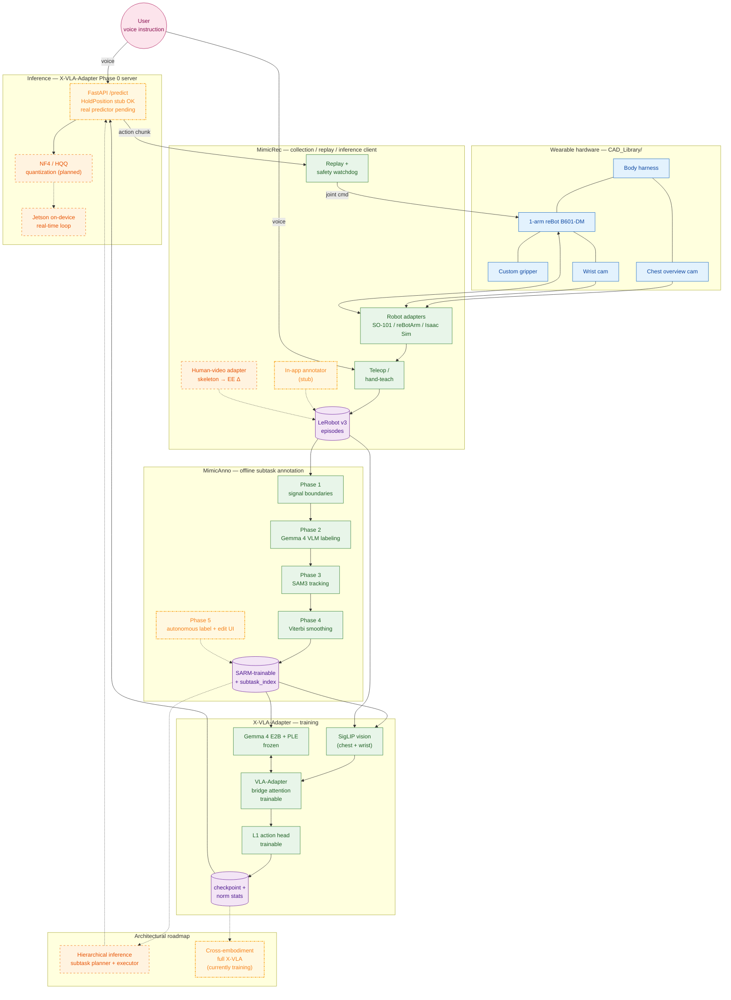
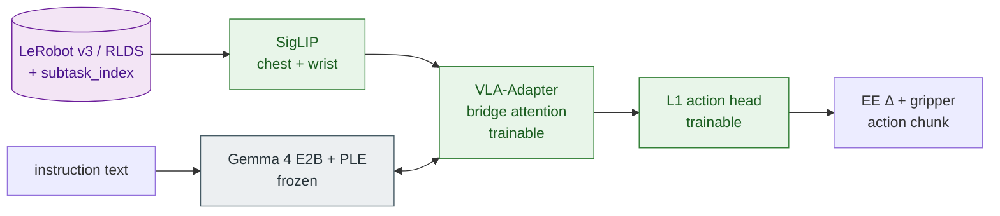
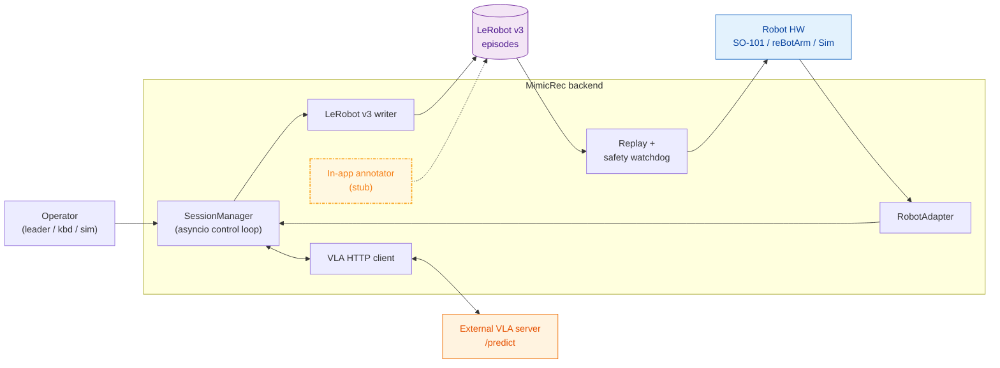
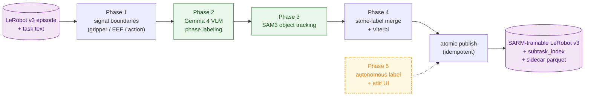

# vla-gemma-4 README design spec

- **Date**: 2026-05-08
- **Owner**: takaki-maeda-99
- **Audience**: Gemma4 Good Hackathon 審査員 + プロジェクトに後から触れる人 (両用)
- **Deliverable**: `vla-gemma-4/README.md` (English) + `vla-gemma-4/README.ja.md` (日本語)
- **Hackathon**: Kaggle × Google DeepMind 主催 **The Gemma 4 Good Hackathon** ([Kaggle URL](https://www.kaggle.com/competitions/gemma-4-good-hackathon/))。 期間 **2026-04-02 〜 2026-05-18 (約 46 日 / 1.5 ヶ月)**。 賞金プール $200K、 カテゴリ: general / impact-focused / technical。 提出必須物: (1) working demo、(2) public code repository、(3) technical write-up — **本 README が (3) を担う**、(4) short video。
- **Reviewed by**: codex (gpt-5.5) on 2026-05-08 — `GO-WITH-CHANGES` 反映済 (revision r2)

## 1. 背景・目的

`vla-gemma-4` リポジトリは **Gemma4 Good Hackathon** に向けた、Gemma 4 をバックボーンとする
**ウェアラブル Vision-Language-Action 相棒ロボット**プロジェクトの umbrella リポジトリ。
ハードウェア (CAD)、データ収集アプリ (MimicRec)、アノテーションパイプライン (MimicAnno)、
VLA モデル本体 (X-VLA-Adapter) の 4 構成要素を束ね — このうち
**MimicRec / MimicAnno / X-VLA-Adapter は git submodule**、 **CAD_Library は通常ディレクトリ**
(SLDPRT/SLDASM/STEP を git-lfs で管理)。 root の README は全体の **アンブレラ説明書 + 審査員向けピッチ** を兼ねる。

現状の root リポジトリは `084d0ba` (2026-05-08) で旧 monolithic コードを撤去し、
`eb0fe15` で root の `CLAUDE.md`/`pyproject.toml` も削除された直後。 README が空白に近く、
審査員にも開発者にも全体像が見えない。本 spec は新 README の構成・章立て・各章の内容を確定し、
書き起こしフェーズで迷わないようにすることを目的とする。

## 2. 想定読者と目的

| 読者 | 目的 | 達成すべき体験 |
|---|---|---|
| ハッカソン審査員 | プロジェクトの USP を 5 分で把握 | TL;DR → Mission → Demo → Why Gemma 4 を読んで「これは Gemma 4 でしか作れない」と納得 |
| 後から関わる開発者 (将来の自分含む) | submodule 群の役割関係と入口を把握 | Component map → Quickstart で「どこから clone して動かすか」が即わかる |
| Twitter / OSS 訪問者 | 一覧性 | Hero + ピッチ + GIF で 30 秒で雰囲気を掴む |

## 3. 採用する全体構成 (案 A: narrative-first)

ブレストでユーザーが選んだ案 A をベースとし、コンポーネント節を厚く取る変形版:

```
0. Header (タイトル / 1-line pitch / バッジ / Hero 画像 placeholder / 言語 toggle)
1. TL;DR for hackathon judges      (★ codex 提案で追加: 5 分評価動線)
2. Mission                          (~150 words)
3. Demo / What it does today        (~250 words + メディア + 再現情報)
4. System overview                   (mermaid 関係図 + 1 段落 + 任意のユーザー手描き画像)
5. Why Gemma 4 + VLA-Adapter         (~300 words、 stack のどこで Gemma 4 が動いているか明示 + VLA-Adapter の効率的適応性)
6. The stack — 4 components          (★ 厚め、各サブモジュール H3 で 4-block 構造)
   6.1 X-VLA-Adapter                 (submodule)
   6.2 MimicRec                      (submodule)
   6.3 MimicAnno                     (submodule)
   6.4 CAD_Library                   (regular dir, git-lfs)
7. Quickstart                        (~250 words、 submodule init / LFS / env を網羅)
8. Safety & Accessibility scoping    (★ codex 提案で追加: 補助具プロトタイプの境界)
9. Status & Roadmap                  (~300 words、 shipped / NOT-IMPLEMENTED-roadmap 二段)
10. Acknowledgements / License
```

長さ目安: 各言語 **400-600 行 / 1200-1800 words** 程度。 component 節を厚く取った結果として 200-400 では収まらないと判断。

## 4. 各セクションの内容 (筆者向け原稿カンペ)

### 4.0 Header

- **タイトル**: `vla-gemma-4`
- **1-line pitch (en)**: "Wearable Vision-Language-Action assistant on Gemma 4 — a hands-free companion arm prototype for people with limb or visual impairments."
- **1-line pitch (ja)**: 「Gemma 4 をバックボーンとした、ハンズフリー・視覚共有のウェアラブル相棒アーム — 腕や視覚に不自由のある方の日常を補助するプロトタイプ。」 (※ 「少しだけ手伝う」を避け、英版と claims を揃える。)
- **バッジ列** (shields.io 想定):
  - `Hackathon: Gemma4 Good Hackathon`
  - `Backbone: Gemma 4 E2B`
  - `Sim benchmark: LIBERO-Spatial 94 %`
  - `Status: research prototype`
  - `Python: 3.12`
  - `License: Apache-2.0`
- **Hero メディア**: `<!-- TODO: docs/images/hero.gif (装着写真 or 実機デモ GIF) -->`
- **言語 toggle**: `**English** | [日本語](README.ja.md)` (en 側) / `[English](README.md) | **日本語**` (ja 側)

### 4.1 TL;DR for hackathon judges (★ 新設)

審査員が冒頭で「5 分で全体を判定する」ための導線。 3 行 + 4 リンク程度に圧縮。

```markdown
## TL;DR

- **What**: A wearable VLA assistant — voice in, action out — built around Gemma 4.
- **Why Gemma 4 + VLA-Adapter**: PLE × VLA-Adapter bridge attention is a unique architectural fit; the LLM stays frozen and only a small adapter/projector/action-head is trained → short-window efficient adaptation. An E2B-class open-weight LLM lets us target on-device offline inference (Jetson).
- **How to evaluate in 5 minutes**:
  1. Watch the demo GIFs in [§3](#demo)
  2. Read the architecture in [§4](#system-overview)
  3. Skim "Why Gemma 4" in [§5](#why-gemma-4)
  4. See LIBERO-Spatial 94 % evidence in [§3 reproducibility](#reproducibility)
```

### 4.2 Mission

3 段落:

1. **誰のために** — 腕や視覚に不自由のある方が日々の小さな所作 (棚から取る、フタを開ける、物を支える) を頼める「もう一本の腕」を必要としている、という出発点。
2. **何を作るか** — 体に装着できる 1 アーム + 胸の俯瞰カメラ + wrist カメラ。 音声で話しかけ、視覚を共有しながら必要な動作だけを補助する semi-autonomous な相棒。 完全自律ではなく、ユーザーの意図に寄り添う設計。
3. **なぜ今** — Gemma 4 のオープンウェイト・小型・on-device 性能と、 VLA-Adapter (Wang et al., 2025) による LLM 凍結 + 小さな adapter のみ学習する **短期間・効率的な適応**手法が、 初めてこの構成を「装着して家で動かす」現実的射程に入れた。 約 1.5 ヶ月のハッカソン期間で v3 → v37 のアーキ sweep を回し v33 で LIBERO 94 % に到達できたのは、 この adaptation efficiency に直接依存している。 ※ 現時点では研究プロトタイプであり、 supervised な実機デモまで。

### 4.3 Demo / What it does today

```markdown
### Representative tasks (実機 scripted demo)

> **Status note**: 以下は supervised な scripted demo です。 安全性確認のため
> オペレーターが常時監視し、 緊急停止が物理ボタン + watchdog で待機している前提。
> 動画 / GIF が公開され次第差し替え (デフォルト alt-text あり)。

- 棚から取る (`take from shelf`) — <!-- TODO: docs/images/demo_shelf.gif -->
- フタを開ける (`open lid`) — <!-- TODO: docs/images/demo_lid.gif -->
- 物を支える / 持つ (`hold / support`) — 持続的アシスト (他 VLA との明確な差分) — <!-- TODO: docs/images/demo_hold.gif -->

### Sim benchmark

- **LIBERO-Spatial 94 %** (X-VLA-Adapter v33, 47/50 ep, 50 episode/suite, 4 タスク × 50 step)
- 学習曲線サムネ: <!-- TODO: docs/images/v33_training_curve.png -->

### Reproducibility (★ codex 必須)

| Artifact | Pointer |
|---|---|
| Train config | `X-VLA-Adapter/configs/train/libero_spatial_v33.yaml` |
| Eval config | `X-VLA-Adapter/configs/eval/libero_v33_step40000.yaml` |
| Checkpoint | <!-- TODO: HF Hub / Drive 公開後に直リンク。 元: `X-VLA-Adapter/outputs/<run>/checkpoints/step_40000/` --> |
| Eval command | `uv run python scripts/eval.py configs/eval/libero_v33_step40000.yaml` |
| Hardware/SW | RTX 6000 Ada / Ubuntu 22.04 / CUDA 12.6 / Python 3.12 / `uv` lockfile committed |
```

レイテンシ表は **載せない** (codex: empty TBD は judges に弱く映る)。 Jetson 数値は Roadmap 内で扱う。

### 4.4 System overview

1 段落のリード文 + **mermaid 関係図** + (任意) ユーザー手描き画像。 mermaid を主、 画像を補助に位置付ける。 mermaid は GitHub renderer (mermaid 10.x) で動く文法のみ使用。

````markdown
> 凡例: 緑 solid = shipped / 黄 dot-dash = in-progress (stub / smoke / 学習中) / 橙 dashed = planned (未着手) / 青 = hardware / 紫 = data store / ピンク = actor。
> Edge: 実線 = 動作する経路、 点線 = in-progress または planned へ向かう経路。



主要なデータ流 (上の図の太字経路):
1. ユーザーの音声 → MimicRec (推論 client) → X-VLA-Adapter Phase 0 server に送信。
2. 胸の俯瞰カメラ + wrist カメラ → SigLIP → VLA-Adapter bridge attention で Gemma 4 (frozen) と対話 → action head → 1 アーム。
3. データ収集ループ: MimicRec で集めた LeRobot v3 episode → MimicAnno で subtask アノテ → X-VLA-Adapter で再学習。
4. on-device offline 動作 (Jetson クラス) を**目標**とし、 学習はクラウド/オンプレ GPU。

**補助画像**: より洗練された装着写真ベースの図はユーザーが手描き予定 — 完成したら `docs/images/system_architecture.png` として併記する。
````

### 4.5 Why Gemma 4 + VLA-Adapter

5 つの柱を箇条書きで書き、 **stack のどこで Gemma 4 が動いているか** を冒頭で明示 (codex 指摘):

```markdown
Gemma 4 がこのプロジェクトで動いている場所:

| Where | What |
|---|---|
| `X-VLA-Adapter` | 推論時の VLA バックボーン (E2B), 各層に bridge attention を介して視覚/動作トークンが注入される |
| `MimicAnno` Phase 2 | オフラインで segment ごとに subtask phase をラベリングする VLM (image-text-to-text) |
| Multilingual instruction | 日英両言語の自然言語指示を直接食わせる |
```

そのうえで USP を 5 点:

1. **Designed for offline on-device** — E2B サイズで Jetson クラスを射程に入れる。 学習時は `bitsandbytes` の 8-bit AdamW optimizer (`X-VLA-Adapter/src/vla_project/training/optim.py`) で memory 圧縮しており、 推論側の NF4 / HQQ 量子化と Jetson real-time 推論ループはどちらも **Roadmap (未着手)**。
2. **PLE × VLA-Adapter bridge attention** — Gemma 4 の Per-Layer Embeddings は層ごとに学習可能な embedding を持ち、 VLA-Adapter が各層に視覚/動作トークンを注入する設計と階層的に同居できる。 PAD placeholder ID で PLE 領域に custom token を流し込む engineering workaround は実装済 (本リポの実装的貢献)。
3. **VLA-Adapter による短期間・効率的な適応** ★ — VLA-Adapter (Wang et al., 2025) は LLM 本体を凍結したまま、 各層に bridge attention を挿し込む小さな adapter + projector + action head のみを学習する。 これにより:
   - 数百〜数千 episode 規模で fine-tune が完結 (full fine-tune 比で桁違いに省コスト)
   - 新ロボット形態 (cross-embodiment) や新タスクへの転移が adapter 入替で効く
   - LoRA r=16/64 と組み合わせて約 1.5 ヶ月のハッカソン期間中に v3 → v37 まで sweep 可能だった
   - ハッカソン期間 (約 46 日、 残 10 日時点) で v33 が LIBERO 94 % に到達できたのはこの efficiency に依存
4. **広範な世界知識 + 多言語** — オブジェクト名・物理直観・日英両言語の指示が generalize の足場になる。
5. **オープンウェイト** — LoRA / 量子化 / アーキ改造を自由に試せる。 v25-v37 の architecture sweep (`X-VLA-Adapter/configs/train/`) はそれに依存している。

### 4.6 The stack — 4 components ★

各サブモジュールに **① 役割 ② できること (capability list) ③ 主な技術選択 ④ 詳細 README リンク** の 4 ブロック構成。

> **Mini mermaid のスコープ**: 各 component の mini mermaid は **アーキテクチャ表現が主目的**で、 status (shipped / in-progress / planned) の正規表現は **§4.4 system overview だけ**。 ただし MimicRec/MimicAnno mini では `MA_P5` / `MR_StubAnno` のように in-progress 状態を視覚的に示すための補助色は使ってよい。

#### 4.6.1 `X-VLA-Adapter/` — VLA model & training & inference

**役割**: SigLIP + Gemma4-E2B + per-domain projector + L1 action head の VLA policy 本体。 LIBERO benchmark を主軸に、 実ロボット deploy までを 1 リポで吸収。

**できること**:
- 1 ファイルの train YAML で全アーキ revision を切替 (v3 → v37、 LoRA / soft-prompt-in-LLM / wrist-into-LLM / DA-2-MLP / etc.)
- 1 ファイルの eval YAML で 50 ep × 4 suite × N step を自動 sweep
- Phase 0 FastAPI 推論サーバ (MimicRec の `/predict` 契約準拠)
- NF4 / HQQ 量子化ツール (Jetson 想定): **(planned)**、 旧 monolithic 構造下の smoke スクリプトは refactor で削除済、 X-VLA-Adapter には未移植
- 4-domain RLDS + LeRobot 両 dataloader、 shared Q99 統計
- 階層 freeze、 LR coef per param group、 checkpoint resume

**設計原則** (CLAUDE.md 由来): `data` / `models` / `policies` / `training` / `evaluation` / `deployment` / `robots` を厳格に分離、 すべて config 駆動、 夜間 sweep でも壊れにくい。

**結果ハイライト**: LIBERO-Spatial v33 = 94 % (47/50)。

**内部フロー**:

````markdown

````

**詳細**: → [`X-VLA-Adapter/README.md`](./X-VLA-Adapter/README.md)

#### 4.6.2 `MimicRec/` — local-first data collection web app

**役割**: 物理ロボから IL データを集めて LeRobot v3 で吐く Web アプリ。 Teleop / Hand-teach / Replay / VLA inference を一気通貫。

**できること**:
- Teleop (leader arm / keyboard / sim) で記録、 Hand-teach は重力補償 + グリッパ摩擦補償付き (reBotArm)
- Replay は arm + gripper 同期再生 + safety watchdog (詳細閾値は MimicRec 設定 YAML)
- VLA HTTP contract YAML 1 枚で任意の VLA モデルを実機にぶら下げ
- LeRobot v3 zip ダウンロード、 エピソード review (success / failure ラベル)
- Settings UI: デバイス検出、 キャリブ状態、 アダプタ config 編集
- ~250 backend tests、 500 Hz モータ制御は別 daemon で安全分離

**対応ハード**: SO-101 / reBot Arm B601-DM / Mock / Isaac Sim (Franka 検証済)。 新ロボットは `RobotAdapter` protocol を 1 ファイル足すだけで UI に出る。

**内部フロー**:

````markdown

````

**詳細**: → [`MimicRec/README.md`](./MimicRec/README.md)

#### 4.6.3 `MimicAnno/` — offline subtask annotation

**役割**: LeRobot v3 episode に subtask boundary + ラベルを付け、 SARM 学習可能 dataset に export するオフラインツール。

**できること**:
- **Phase 1**: signal-driven boundary 検出 (gripper transition / EEF 速度 / action-norm change point)
- **Phase 2**: Gemma 4 VLM で segment ごとに phase ラベリング (allowed-label + JSON schema 強制、 不正出力で fail-fast)
- **Phase 3**: SAM3 で task-text-driven object tracking、 boundary score へ統合
- **Phase 4**: 同ラベル merge + min-duration absorb + Viterbi relabel
- **Export**: per-frame `subtask_index` + episode-level subtask list、 atomic publish、 idempotent re-run
- React/Vite read-only timeline + waveform viewer
- YAML で任意の LeRobot v3 layout に対応 (so100 / koch / aloha / SO101 generic)

**内部フロー**:

````markdown

````

**詳細**: → [`MimicAnno/README.md`](./MimicAnno/README.md)

#### 4.6.4 `CAD_Library/` — wearable hardware (regular dir, git-lfs)

**役割**: ウェアラブル装着の物理一式 (オープン CAD)。 **submodule ではなく root リポジトリ内の通常ディレクトリ** で、 SLDPRT / SLDASM / STEP は git-lfs で管理。

**収録**:
- `Robot_Arm/reBot_B601_DM_v1.0_20260331.step` — アーム本体 (STEP)
- `Gripper/gripper.SLDASM` — カスタム軽量グリッパ
- `Harness/bodey harness.SLDASM` — 体に装着するハーネス
- `Data_Collection_Device/{ver1,ver2}/` — 胸カメラ + データ収集治具

**閲覧**: SolidWorks があれば直接、 そうでなければ STEP を CAD ビューワーや FreeCAD で開けば寸法は確認できる。

### 4.7 Quickstart (★ codex 拡充)

```markdown
## Quickstart

```bash
git clone --recurse-submodules <url> && cd vla-gemma-4
git submodule update --init --recursive   # forgot --recurse-submodules?
git lfs install && git lfs pull            # CAD_Library STEP/SLDASM の取得
```

3 つの動線への入口:

| やりたいこと | 入口 |
|---|---|
| 学習だけ試す (LIBERO sim) | → [`X-VLA-Adapter/README.md#Training`](./X-VLA-Adapter/README.md#training) |
| データ収集してみる (実機 / mock / sim) | → [`MimicRec/README.md#Quick-start`](./MimicRec/README.md#quick-start) |
| アノテだけ試す (既存 dataset) | → [`MimicAnno/README.md#Quickstart`](./MimicAnno/README.md#quickstart) |

**root から直接動かせるもの**: 現時点ではなし。 各 submodule README が単体動作の SoT。
end-to-end (collect → annotate → train → infer → replay) の最小コマンド列は将来追加予定。

**前提環境**: Ubuntu 22.04 / 24.04、 Python 3.12 (`uv` が pull)、 Node 20+ (MimicRec フロントエンド)、 NVIDIA GPU + CUDA 12.6+ (X-VLA-Adapter 学習)。 Mac / WSL は submodule によっては動作未確認。
```

### 4.8 Safety & Accessibility scoping (★ 新設)

これは wearable assistive prototype として README で**必ず明示**する境界。 「現状の安全措置」 と 「scope 限界」 の二段で書き、 後から数値や手順を追記しやすいよう **explicit subsection** として用意する。

```markdown
## Safety & Scope

### Current safety measures (現状の安全措置)

- **Physical emergency stop (E-stop)**: <!-- TODO: ボタン位置 / latency / 停止トルク を実機計測後に記入 -->
- **Software watchdog**: replay path で joint position jump / velocity / acceleration の三段ゲート (`MimicRec/configs/robot/<robot>.yaml` の `replay:` ブロック)。 daemon 側でも追加 clamp あり (`configs/rebotarm_daemon.yaml` `safety:`)
- **Soft stop (graceful halt)**: <!-- TODO: 音声 "stop" / "止まって" でのソフト停止挙動を実装後記入 -->
- **Action rate limit**: <!-- TODO: 実機での EE Δ 上限と gripper 速度上限を記入 -->
- **Operator presence**: 実機デモ中はオペレーターが常時監視、 E-stop に手が届く距離

### Scope (this is what the project is, and is not)

- This is a **research prototype**, NOT a medical device or certified assistive device.
- All real-robot demos shown are **operator-supervised**; the safety measures above are required for any session.
- Unsupervised home deployment is **explicitly out of scope**.
- Camera and voice data: by default everything stays on-device. No cloud upload by the runtime path.
- Intended assistance is single-task, short-horizon manipulation while the operator is conscious and able to halt the system.
- We do not claim accessibility certification, regulatory approval, or clinical efficacy.
```

両言語版で **同等の claims** を載せる (日本語側を弱めない、 codex 指摘)。 安全措置サブセクションは README 公開時点で TODO が残っていてもよいが、 「無記入のまま公開しない」 を完了基準に含める。

### 4.9 Status & Roadmap

```markdown
## Status

3 段に分けて進捗を視覚的に明示する: **Shipped / In progress / Roadmap**。 mermaid 凡例 (緑 / 黄 dot-dash / 橙 dashed) と対応。

### Shipped (2026-05-09 時点で動く / 評価可能)
- **(shipped)** LIBERO-Spatial 94 % (X-VLA-Adapter v33) — 再現情報は §3 (config + eval cmd + checkpoint 公開)
- **(shipped)** 実機 2-3 タスク **scripted demo** (棚から取る / フタを開ける / 支える) — 動画 1 本以上を README §3 に貼る
- **(shipped)** MimicAnno Phase 1-4 アノテパイプライン (signal boundary / Gemma 4 VLM / SAM3 / Viterbi)
- **(shipped)** MimicRec end-to-end (collect → review → replay) on SO-101 / reBot Arm / Isaac Sim
- **(shipped)** ハードウェア prototype (`CAD_Library/`) が装着可能、 STEP / SLDASM / SLDPRT 公開
- **(shipped)** 学習時 8-bit AdamW (`bitsandbytes`) による optimizer-state 圧縮

### In progress (2026-05-09 時点で部分的に動く / 開発中)
- **(in-progress)** X-VLA-Adapter Phase 0 推論サーバ: HoldPosition stub の wire smoke は通る。 実モデル (`XVLAAdapterChunkPredictor`) は v36 ckpt 待ちの stub
- **(in-progress)** Cross-embodiment X-VLA: v34 / v35 multi-domain RLDS で**学習中**、 eval 待ち
- **(in-progress)** MimicAnno Phase 5: 自律ラベル + 編集 UI、 自律モード進行中
- **(in-progress)** MimicRec の in-app annotator: stub 段階 (本実装は MimicAnno に外出し)

### Roadmap — NOT IMPLEMENTED
> 以下は未着手の研究方針です。 shipped / in-progress と混同しないために明示的に分けています。

- **Scale data**:
  - **(planned)** MimicRec の新アダプター: 人の一人称視点動画 → 手骨格推定 → EE Δ + Gripper 表現にマッピング → アクションデータ生成 → 転移学習でデータ収集をスケール
- **Architecture**:
  - **(planned)** MimicAnno の subtask を活用した階層的推論: high-level subtask planner + low-level skill executor の二層構成 (現在の monolithic VLA を超えるフェーズ)。 MimicAnno は学習データを既に出力できるが、 推論側の階層モデルは未実装。
- **Deployment**:
  - **(planned)** 推論側 NF4 / HQQ 量子化。 旧 monolithic 構造下の smoke スクリプト (`test_nf4_26b_smoke.py` 等) は refactor (084d0ba) で削除済、 X-VLA-Adapter には未移植。
  - **(planned)** Jetson on-device real-time 推論ループ (TensorRT / 量子化推論統合)。

```

Status の各項目に **`(shipped) / (in-progress) / (planned)`** タグを付ける (3 値分類)。 進捗が動いたら spec を更新せず、 README の該当行を直接昇格させる方針 (出来たと思ったら shipped に昇格、 など)。

### 4.10 Acknowledgements / License

```markdown
## Acknowledgements

- **Hackathon**: Gemma4 Good Hackathon (2026-05-18 提出)
- **Upstream**: VLA-Adapter (Wang et al., 2025) / X-VLA / SigLIP / Gemma 4 / LeRobot / SAM3 / LIBERO

## License

- root リポジトリ: **Apache-2.0** (`LICENSE` 参照)
- すべての submodule (`MimicRec`, `MimicAnno`, `X-VLA-Adapter`): **Apache-2.0**
- CAD_Library 内の SLDPRT / SLDASM / STEP: 個別ライセンスは LICENSE に従う
- 上流ライブラリは各々のライセンス (LeRobot, SAM3 等)
```

## 5. ファイル成果物と置き場所

| ファイル | 内容 |
|---|---|
| `README.md` | 英語版 (上記 4.0-4.10 をそのまま英訳) |
| `README.ja.md` | 日本語版 (上記 4.0-4.10 をそのまま日本語) |
| `docs/images/` | hero / demo gif / system_architecture.png 置き場 (まだ空、 placeholder) |

ja / en 両ファイルは **claims-parity** (情報・主張・免責が同じ) を貫く。 トーンは多少違っても OK だが、 一方だけに新事実 / 弱い免責 / 強い断定が載るのは禁止。 特に Mission / Safety / Roadmap セクションは語強度を揃える。

## 6. スコープ外 (この spec で扱わないこと)

- README 以外のドキュメント (CONTRIBUTING.md, CODE_OF_CONDUCT.md, etc.) は今回作らない
- 各 submodule README の内容変更 (root README からのリンクが破れない範囲で submodule は不変)
- mermaid / 画像素材の本実装 (placeholder 設置のみ。 画像はユーザーが後で差し替える)
- 実機デモ動画の撮影・収録 (README にリンクするのみ、 撮影は別タスク)
- Hackathon 提出フォーム / 動画スクリプト
- 臨床的・医療的補助具としての適合性主張
- Unsupervised な家庭内自律動作の主張
- 検証されていない Jetson real-time レイテンシ数値の掲載
- 動作未確認の root レベル end-to-end コマンド列
- submodule API ドキュメントを root に重複掲載すること
- 個人を特定できる映像 / ライセンス未確認のメディア

## 7. オープンクエスチョン (★ codex 提案で strategic に置換)

1. **shipped 実機デモの evidence floor**: 公開時に最低限「動画 1 本 + 撮影日」を必須化するか、 「scripted demo, video pending」 の caveat だけで公開してよいか? → **既定: 動画 1 本必須、 間に合わなければ Roadmap に降格。**
2. **Jetson オフライン推論の到達状況**: shipped か、 partial か、 target only か? README ではどう書くか? → **既定: target only と明記、 NF4/HQQ smoke test 済の事実だけ "Why Gemma 4" §1 に括弧書き。**
3. **LIBERO 94 % の artifacts 公開可否**: checkpoint をリポ外 (HF Hub / Drive 等) に置くか、 評価コマンド + config だけ公開するか? → **既定 (ユーザー確定): checkpoint は公開する。** 公開先は HF Hub または Drive を想定、 README §3 Reproducibility 表の "Checkpoint" 行に直リンクを載せる。 公開時に**併載する責務**:
   - 学習 config (`configs/train/libero_spatial_v33.yaml`) と eval config の git commit hash
   - 正規化統計 (`norm_stats.json` / `meta.json` 内、 action mean/std + proprio mean/std)
   - tokenizer / processor settings、 SigLIP ・ Gemma 4 のバージョン pin
   - hardware spec (RTX 6000 Ada / CUDA 12.6 / Python 3.12)
   - eval command + 期待出力 (`47/50` etc.)
   - License attribution (Apache-2.0)、 簡易 model card (限界・想定外動作の section 必須)
4. **Safety & Accessibility 免責の言語別レビュー**: 日本語版を法務的に確認する人が必要か? → **既定: 法務レビューなし、 codex の指摘通り claims-parity だけ満たす。**
5. **Hero メディアが間に合わなかった場合の判断**: alt-text のみで公開、 Header 画像なしで OK か? → **既定: yes、 alt-text + 1-line 説明で許容。**

## 8. 完了基準

1. `README.md` (en) と `README.ja.md` (ja) が上記 4.0-4.10 をすべて含む形で書き出されている
2. 両ファイルの中身が「同一情報・主張」 (claims-parity) になっている
3. すべての submodule リンクが GitHub 上で deadlink にならない
4. 画像 placeholder の `<!-- TODO: ... -->` コメントが英版・日本版とも対応する位置に置かれている
5. ハッカソン名・shield バッジ・hackathon deadline が両言語版で一致
6. **Roadmap 項目には全て `(planned)` プレフィックスが付き、 shipped と視覚的に分離されている**
7. **Safety & Scope セクションが両言語に同等強度で存在する**
8. **LIBERO 94 % のエビデンス (config / eval cmd / hardware spec) が §3 Reproducibility 表に列挙されている**
9. **License バッジ・§4.10 が Apache-2.0 で一致**
10. ファイルが git add 済 (commit はユーザー判断)
